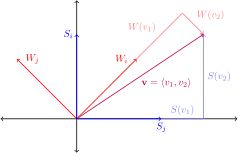

$$
\newcommand{\set}[1]{ \{#1\} }
\DeclareMathOperator{\span}{\text{span}}
\DeclareMathOperator{\L}{\mathcal{L}}
\DeclareMathOperator{\P}{\mathcal{P}}
$$

* toc
{:toc}

---

# Linear systems

A *linear equation* is simply an equation involving variables/indeterminates
with powers one (or zero). $x=4$ is linear while $x^2=4$ is not (quadratic).
Linear equations take the form

$$
a_1 x_1+a_2 x_2+\cdots+a_n x_n = d
$$

Linear equations have a set of solutions with values for the variables which
solve the equation consistently. For $x=4$, the only solution for the
variable x is 4 such that $4=4$. This is consistent with the definition of the
equation.

A *linear system* is when we consider several equations to be related. A linear
system has the form (where rows/equations are labeled $p_1,\ldots,p_j$)

$$
\begin{aligned}
p_1&: & a_{1,1}x_1+a_{1,2}x_2+\cdots+a_{1,n}x_n &= d_1 \\
\vdots \\
p_i&: & a_{i,1}x_1+a_{i,2}x_2+\cdots+a_{i,n}x_n &= d_i \\
\vdots \\
p_j&: & a_{j,1}x_1+a_{j,2}x_2+\cdots+a_{j,n}x_n &= d_j
\end{aligned}
$$

Solutions to a linear system are values which solve all the equations at the
same time. For example the linear system

$$
\begin{aligned}
x &= 1 \\
x + y &= 3
\end{aligned}
$$

Has a solution when $x=1$ and $y=2$, denoted as the tuple $(1,2)$.
This is verifiable by plugging the first equation into the second and solving
for y. This method often works well enough but *elementary operations* allow us
to more easily solve systems.

# Elementary operations

We can manipulate linear systems to make them appear simpler and potentially
lead to the solutions of the system. We call these manipulations elementary
operations, row operations, or Gaussian, and we have *addition*, *scalar
multiplication* and *swapping*. For the operations, consider the example system

$$
\begin{aligned}
p_1&: & x &= 1 \\ p_2&: & x + y &= 3 \end{aligned}
$$

### Scalar multiplication

In the scalar multiplication operation we are allowed to multiple every term in
a single row by some number (a scalar) and replace what was there.
For the example we start my multiplying row 1 by -1

$$
\xrightarrow{(-1)p_1}~:
\begin{aligned} -x &= -1 \\ x + y &= 3 \end{aligned}
$$

### Addition

In the addition operation we are allowed to add the terms of one equation to
the terms of another and replace what was there with the new sum. For the
example system replace row 2 by addition rows 1 and 2 together

$$
\xrightarrow{p_1+p_2}~:
\begin{aligned} -x &= -1 \\ (-x)+x+y &= (-1)+3 \end{aligned}
\Rightarrow
\begin{aligned} -x &= -1 \\ y &= 2 \end{aligned}
$$

We would then want to again multiply row 1 by -1 to get a solution in terms of x
and y

$$
\xrightarrow{(-1)p_1}~:
\begin{aligned} x &= 1 \\ y &= 2 \end{aligned}
$$

But starting from the beginning, we could have done both operations at once:
multiplying row 1 by -1 before adding it to row 2 (consider this subtracting one
row from another)

$$
\xrightarrow{(-1)p_1+p_2}~:
\begin{aligned} x &= 1 \\ y &= 2 \end{aligned}
$$

### Swap

In the swap operation we are allowed to exchange any two rows with one another.
In this previous example it isn't useful, but when systems contain rows with out
of order leading terms, we want to swap them into a sort of descending order.
For example

$$
\begin{array}{ 4*r }
  & y & + & z = d \\
x &   & + & z = e \\
  &   &   & z = f
\end{array}
\Rightarrow~
\xrightarrow{p_1\leftrightarrow p_2}~:
\begin{array}{ 4*r }
x &   & + & z = e \\
  & y & + & z = d \\
  &   &   & z = f
\end{array}
$$

Swapping rows 1 and 2 tidy up the system, and is important for future methods.

# Matrices

A matrix is a rectangular array of elements.
A matrix has dimensions *m* rows and *n* columns written as $m\times n$.
The location of an element is given by its ith row
and jth column positions, and is the jth element.
These exact location of elements are crucial.
The form of a matrix is such

$$
\begin{pmatrix}
a_{11} & a_{12} & \cdots & a_{1j} \\
a_{21} & a_{22} & \cdots & a_{2j} \\
\vdots & \vdots & \ddots & \vdots \\
a_{i1} & a_{i2} & \cdots & a_{ij}
\end{pmatrix}
= [a_{ij}]\in \R^{m\times n}
$$

For example

$$
\begin{pmatrix}
0 & 6 & 1 \\
2 & 4 & 3
\end{pmatrix}
= \begin{pmatrix}
b_{11} & b_{12} & b_{13} \\
b_{21} & b_{22} & b_{23}
\end{pmatrix}
\Rightarrow
\begin{array}{3*c}
b_{11}=0 & b_{12}=6 & b_{13}=1 \\
b_{21}=2 & b_{22}=4 & b_{23}=3
\end{array}
$$

A matrix with with values only in one dimension is called a vector. If it's only
a column then it's a *column vector*, and a *row vector* if it's only a row.
Vectors are denoted with an arrow over the symbol.

$$
\vec u = \begin{pmatrix} a \\ b \\ c \end{pmatrix}
\quad
\vec v = \begin{pmatrix} a & b & c \end{pmatrix}
$$

## Matrix operations

Similar to equations in linear systems, we can apply operations to matrices, in
particular *addition*, *scalar multiplication* and *matrix multiplication*.

### Scalar multiplication

In scalar multiplication a new matrix is produced by multiplying a number to
every term in a matrix.
Given a matrix $A=[a_{ij}]\in\R^{m\times n}$ and a scalar $k$

$$
k\cdot A = [k\cdot a_{ij}]\in\R^{m\times n}
$$

### Matrix addition

In matrix addition a new matrix is produced by adding the terms of two
matrices together corresponding to location.
Given matrices $A=[a_{ij}]\in\R^{m\times n}$ and $B=[b_{ij}]\in\R^{m\times n}$

$$
A+B = [a_{ij}+b_{ij}]\in\R^{m\times n}
$$

### Matrix multiplication

Matrix multiplication is a binary operation between two matrices, *left* and
*right*, which produces a new matrix. The conditions is if left has *n* columns,
then right must have *n* rows. That is, left has dimensions $m\times n$ and
right has dimensions $n\times p$.

$$
A\times B
= \begin{pmatrix}
  a_{11} & a_{12} & \cdots & a_{1n} \\
  \vdots & \vdots & \ddots & \vdots \\
  a_{m1} & a_{m2} & \cdots & a_{mn}
\end{pmatrix}
\begin{pmatrix}
  b_{11} & \cdots & b_{1p} \\
  b_{21} & \cdots & b_{2p} \\
  \vdots & \ddots & \vdots \\
  b_{n1} & \cdots & b_{np}
\end{pmatrix}
$$

The number of rows in left and the number of columns in right are arbitrary but
will change the dimensions of the resulting matrix. The result will have only as
many rows as left and only as many columns as right.
The operation is highly algorithmic and follows the same pattern.
Multiplying two $2\times 2$ matrices is a good example

$$
\begin{pmatrix}
  \color{red}{a_1} & \color{red}{a_2} \\
  \color{green}{a_3} & \color{green}{a_4}
\end{pmatrix}
\begin{pmatrix}
  \color{blue}{b_1} & \color{orange}{b_2} \\
  \color{blue}{b_3} & \color{orange}{b_4}
\end{pmatrix} =
\begin{pmatrix}
  \color{red}{a_1}\color{blue}{b_1}+\color{red}{a_2}\color{blue}{b_3} &
  \color{red}{a_1}\color{orange}{b_2}+\color{red}{a_2}\color{orange}{b_4} \\
  \color{green}{a_3}\color{blue}{b_1}+\color{green}{a_4}\color{blue}{b_3} &
  \color{green}{a_3}\color{orange}{b_2}+\color{green}{a_4}\color{orange}{b_4}
\end{pmatrix}
$$

Considering the arbitrary dimensions, if left had only 1 row then so would the
result, and if right had only 1 column then so would the result.

$$
\begin{pmatrix}
  \color{red}{a_1} & \color{red}{a_2}
\end{pmatrix}
\begin{pmatrix}
  \color{blue}{b_1} & \color{orange}{b_2} \\
  \color{blue}{b_3} & \color{orange}{b_4}
\end{pmatrix} =
\begin{pmatrix}
  \color{red}{a_1}\color{blue}{b_1}+\color{red}{a_2}\color{blue}{b_3} &
  \color{red}{a_1}\color{orange}{b_2}+\color{red}{a_2}\color{orange}{b_4}
\end{pmatrix}
\\
\begin{pmatrix}
  \color{red}{a_1} & \color{red}{a_2} \\
  \color{green}{a_3} & \color{green}{a_4}
\end{pmatrix}
\begin{pmatrix}
  \color{blue}{b_1} \\
  \color{blue}{b_2}
\end{pmatrix} =
\begin{pmatrix}
  \color{red}{a_1}\color{blue}{b_1}+\color{red}{a_2}\color{blue}{b_2} \\
  \color{green}{a_3}\color{blue}{b_1}+\color{green}{a_4}\color{blue}{b_2}
\end{pmatrix}
$$

## Matrix abbreviation of linear systems

Applying elementary operations to equations in linear systems is be notationally
tedious. To make life better if we treat each indeterminate as a column position
in a matrix and each equation as a row position we can represent the system as
a matrix with values corresponding to the coefficients of the indeterminates.
Whatever falls on the right side of the equation will be placed into an extra
column on the right of the matrix, separated from the indeterminate columns by a
line. This is called an *augmented matrix*.

$$
  \begin{array}{ *7r }
     x & + &  y &   &    & = & 0 \\
    2x & - &  y & + & 3z & = & 3 \\
     x & - & 2y & - &  z & = & 3
  \end{array}
  \Leftrightarrow
  \left(\begin{array}{@{}rrr|r@{}}
    1 & 1 & 0 & 0 \\
    2 & -1 & 3 & 3 \\
    1 & -2 & -1 & 3
  \end{array}\right)
$$

Operating on system becomes notationally simpler.

$$
\begin{aligned}
  \left(\begin{array}{@{}rrr|r@{}}
    1 & 1 & 0 & 0 \\
    2 & -1 & 3 & 3 \\
    1 & -2 & -1 & 3
  \end{array}\right)
  \begin{array}{r}
    \\
    -2p_1+p_2 \\
    -p_1+p_3
  \end{array}
  &\Rightarrow
  \left(\begin{array}{@{}rrr|r@{}}
    1 & 1 & 0 & 0 \\
    0 & -3 & 3 & 3 \\
    0 & -3 & -1 & 3
  \end{array}\right)
  \begin{array}{r}
    \\
    -p_2+p_3 \\
    \\
  \end{array} \\
  &\Rightarrow
  \left(\begin{array}{@{}rrr|r@{}}
    1 & 1 & 0 & 0 \\
    0 & -3 & 3 & 3 \\
    0 & 0 & -4 & 0
  \end{array}\right)
  \begin{array}{r}
    \\
    -\frac{1}{3}p_2 \\
    -\frac{1}{4}p_3 \\
  \end{array} \\
  &\Rightarrow
  \left(\begin{array}{@{}rrr|r@{}}
    1 & 1 & 0 & 0 \\
    0 & 1 & -1 & -1 \\
    0 & 0 & 1 & 0
  \end{array}\right)
  \begin{array}{r}
    \\
    p_3+p_2 \\
    \\
  \end{array} \\
  &\Rightarrow
  \left(\begin{array}{@{}rrr|r@{}}
    1 & 1 & 0 & 0 \\
    0 & 1 & 0 & -1 \\
    0 & 0 & 1 & 0
  \end{array}\right)
  \begin{array}{r}
    -p_2+p_1 \\
    \\
    \\
  \end{array} \\
  &\Rightarrow
  \left(\begin{array}{@{}rrr|r@{}}
    1 & 0 & 0 & 1 \\
    0 & 1 & 0 & -1 \\
    0 & 0 & 1 & 0
  \end{array}\right)
\end{aligned}
$$

And we can express the solution to a linear system as a vector

$$
\vec s = \begin{pmatrix} 1 \\ -1 \\ 0 \end{pmatrix}
$$

# Linear Systems (cont.)

## Gaussian Elimination

## Gauss-Jordan Elimination

## Elementary Matrices and Operations

An elementary matrix is defined as a variation of the identity matrix but with a
single element changed. Because any matrix can be expressed as the result of a
series of matrix operations, then any non-elementary matrix can be expressed as
the product of a series of elementary matrix. In other words the operations we
applied on linear systems previously in syntax like $p_1+p_3$ (store $p_3$) can
be expressed as matrix operations involving elementary matrices.

## Vectors

A vector can be described as an ordered set of coordinates in $n$ dimensions,
but also as a direction to move in space and the amount which to move. Both are
valid. Notationally, a vector can have an arrow above the symbol
($\vec{u}$) or can be bold ($\mathbf u$), but both express the same
meaning in that the symbol u is a vector. What is not inherently encoded is the
dimension the vector is in, that that depends on context.

-- | --
A vector | $\vec u=\langle u_1,u_2,\cdots,u_n\rangle\in\mathbb R^n$
Closure of addition | $\vec u+\vec v=\langle (u_1+w_1),\cdots,(u_n+w_n)\rangle\in\mathbb R^n$
Closure of scalar multiplication | $\alpha\vec u=\langle \alpha u_1,\cdots,\alpha u_n\rangle\in\mathbb R^n$
Zero element | $\vec 0=\langle 0_1,\cdots,0_n\rangle\in\mathbb R^n$
Associativity of additon | $\vec u+(\vec v+\vec w)=(\vec u+\vec v)+\vec w$
Commutativity of addition | $\vec u+\vec v=\vec v+\vec u$
Identity element of addition | $\vec v+\vec 0=\vec v$
Inverse elements of addition | $\vec v+(-\vec v)=0$
Identity element of multiplication | $ 0\cdot\vec u=\vec 0$
| $1\cdot\vec v=\vec v$
Distributivity of scalar multiplication | $\alpha(\vec v+\vec u)=\alpha\vec u+\alpha\vec v$
| $(\alpha+\beta)\vec u=\alpha\vec u+\beta\vec u$

## Vector spaces

A *vector space* is a collection of vector elements  which can be added together
or be multiplied by scalars. Of the properties of a vector space, closure
properties guarantee that addition or scalar multiplication return a value that
is also a member of the vector space. A vector space must have these two
properties to be considered a vector space.

-- | --
Closure of addition | $\vec u+\vec v\in V$
Closure of scalar multiplication | $\alpha\vec v\in V$

### Basis, span and dependence

A *span* is the set of all possible vectors from a linear combination of
vectors. Two non-parallel vectors have the span of all vectors within the plane
on which the two vectors lie; three non-parallel vectors have the span of all
three-dimensional space.

The *basis* of a vector space is a set of *n* linearly independent vectors that
span the full space in *n*-dimensions. In the case of the two vectors defining
the span within a plane, the basis of that span are the two original vectors.
The basis set of three unit vectors in the direction of the x-axis, the y-axis
and z-axies respectively is called the *standard* basis, and notated as
$\hat\imath$, $\hat\jmath$ and $\hat k$ (i-hat, j-hat, k-hat).

$$
\begin{gather}
\hat \imath=e_1=e_{x}=(1,0,0)\\
\hat \jmath=e_2=e_{y}=(0,1,0)\\
\hat k=e_3=e_{z}=(0,0,1)
\end{gather}
$$

By defining the basis of a vector space we can describe any vector in that space
as the linear combination of the basis vectors.

$$
\vec A=(A_{x})\hat\imath+(A_{y})\hat\jmath+(A_z)\hat k
$$

For a set of vectors to be basis they must all be linearly independent;
basically meaning that of the vectors in the set, none are multiples. Consider a
set of three vectors of which two are parallel. Because any point on the line
on which both the parallel vectors lie can be produced by multiplying either of
the vectors by some scalar, we could reduce the set and have no loss of span by
removing one of the parallel vectors.

A list $v_1,\ldots,v_n$ of vectors in vectorspace $V$ is a basis for $V$
if and only if for all $v$ can be written uniquely in the form

$$
v=\sum_{l=1}^n a_l v_l,~ a_1,\ldots,a_n\in\F
$$

Every spanning list in a vector space can be reduced to a basis of the vector
space.



## Transformations

Given T, a linear transformation of vector v from vector space V into W,
the *kernel* is a subset of V where $T(\vec v)=0$. Since $\text{kern}(t)$ is
a subspace of V, then it must have the following properties of closure:

- $T(\alpha\vec v)=0=\alpha T(\vec v)$
- $T(\vec v+\vec w)=T(\vec v)+T(\vec w)$

Range of T is the set of all vectors in W of the form $T(\vec v)$, thus
$\text{range}(T)$ is a subspace of $W$.

<!--

If $\vec w\in\text{range}(T)$ then $\vec w=T(\vec v)$ for some $\vec v$ in $V$.

$\alpha\vec w=\alpha(T(\vec v))=T(\alpha\vec v)\Rightarrow\alpha\vec w \in\text{range}(T)$

If $\vec w_1,\vec w_2\in\text{range}(T)$ then $\vec w_1=T(\vec v_1),\vec
w_2=T(\vec v_2)$

- $T$ is injective (1 to 1) if $\text{kern}(T)=\{0\}$. A function $f(x)$ is 1 to
    1 if $x_1\neq x_2\Rightarrow f(x_1)\neq f(x_2)$ following the horizontal line
    test.
- $T$ is surjective (onto) if $\text{range}(T)=W$.

How to show if kernel is injective?

If $T$ a linear transformation is 1 to 1 then $\text{kern}(T)=\{0\}$.
Given $\vec{v_1},\vec{v_2}\in V$ then

$$
\begin{gather}
T(T(\vec{v_1})=T(\vec{v_2} \\
T(\vec{v_1})-T(\vec{v_2})=0 \\
T(\vec{v_1}-\vec{v_2})=0 \\
\text{if kern}(T)=\{0\}
v1-v2=0
v1=v2
If ker(T) = 0 then T is 1-1

\end{gather}
$$

Assume that $T$ is 1 to 1, show for ker(T)={0}

T(0)=0 by linear
0 is in ker(T)
If $T$ is 1 to 1 then $\vec 0$ is only vector that
$T(v)=0\Rightarrow \text{ker}(T)=\{0\}$.

If T:V->V is a linear transofmration and T is 1 to 1, then what we say about the
matrix of T? (V is finite dimensional)

If T is 1 to 1 then T^-1 exists

T: v->w->T^{-1}(v)
Then the matrix A (of T) also must have an inverse A^{-1}.

-->

### Change in basis

Given a vector $\vec v$ defined by it's coordinates $\langle v_1,v_2\rangle$
within the standard basis $S=\langle u_1,u_2\rangle=\langle e_i,e_j\rangle$,
how can we describe these coordinates in a non-standard basis? Given a second
basis $W=\langle w_1,w_2\rangle$ that is non-standard ( $W\neq\langle
e_i,e_j\rangle$) we can convert the standard coordinates of the vector $\vec v$
to non-standard ordinates by applying the inverse of the matrix representing
basis $W$.

$$
W=\left[\begin{matrix}w_{1x}&w_{1y}\\w_{2x}&w_{2y}\end{matrix}\right];\
W^{-1}(\vec v)_S\rightarrow(\vec v)_W
$$

In any change of the base the actually vector remains the same, but is now
described by using different coefficients for the different base.

{:width="512px"}

---

# Bases



---

# Polynomial space









---

# Linear Maps

$\L$

<!--- The zero map -->
- Identity $I\in\L(V,V)$ defined by

$$
Iv\equiv I(v)=v
$$

- Differentiation $D\in\L(\P(\F),\P(\F))$ defined by

$$
$$

- Integration $T\in\L(\P(\R),\R)$ defined by

$$
T_p\equiv T(p)=\int_0^1 p(x)~dx
$$

- Backward shift $T\in\L(\F^\infty,\F^\infty)$ (even though the indexes are
shifted forward) defined by

$$
T(z_1,z_2,\ldots)=T(z_2,z_3,\ldots)
$$

## Examples

### $\R^3\to\R^2$

Define $T\in\L(\R^3,\R^2)$ as

$$
T(x,y,z)=(x-y+z,\pi x+e^\pi y+z)
$$

### $\F^n\to\F^m$

Here $T\in\L(\F^n,\F^m)$ is defined as

$$
T(x_1,\ldots,x_n)
= (A_{1,1}x_1+\cdots+A_{1,n}x_n,\ldots,A_{m,1}x_1+\cdots+A_{m,n}x_n)
$$ 

For scalars $A_{i,j}$ and $x_i$.
Every linear map $\F^n\to\F^m$ can be written in this form.

