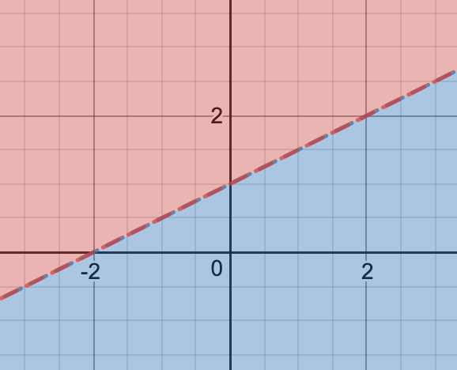
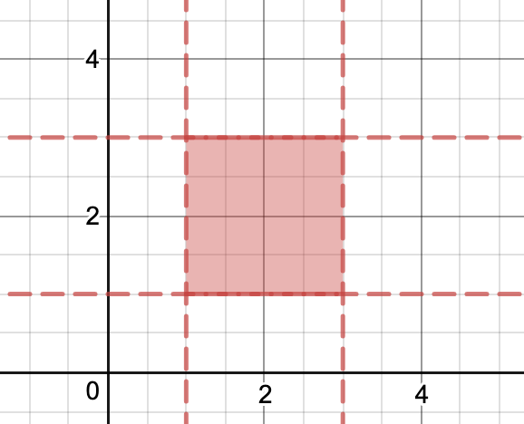

$$
\newcommand{\set}[1]{ \{#1\} }
\newcommand{\abs}[1]{\lvert #1\rvert}
\newcommand{\norm}[1]{\lVert #1\rVert}
\newcommand{\genset}[1]{ {\langle #1\rangle} }
\DeclareMathOperator{\sge}{\mathsf e}
\DeclareMathOperator{\sgm}{\mathsf m}
\DeclareMathOperator{\sgG}{\mathsf G}
\DeclareMathOperator{\sgg}{\mathsf g}
\DeclareMathOperator{\sgF}{\mathsf F}
\DeclareMathOperator{\sgAp}{\text{Ap}}
\DeclareMathOperator{\calPF}{\text{PF}}
\DeclareMathOperator{\sgt}{\mathsf{t}}
\DeclareMathOperator{\conv}{\text{conv}}
\DeclareMathOperator{\span}{\text{span}}
\DeclareMathOperator{\calP}{\mathcal{P}}
$$

* toc
{:toc}

---

  <a href="./polytope.html">
    Polytope Renderer!
  </a>

---

# Numerical Semigroups



Typically a semigroup is expressed

$$
S
= \langle n_1,\ldots,n_k\rangle
= \{a_1 n_1+\cdots+a_k n_k:a_1,\ldots,a_k\in\Z_{\ge 0}\}
$$

This reads as $S$ being the set of all numbers that are positive linear
combinations of the $n_j$ generator elements and where all $a_j$ coefficients
are positive integers. See [factorizations](#factorizations) to see how the
construction of these elements as linear combinations (as factorizations) can be
denoted.

<!--
   -As an example, $S=\langle 4,6\rangle$ is not a semigroup (does not contain odds)
   -while $S'=\langle 2,3\rangle$.
   -A function which maps from $S$ to $S'$ by dividing any element by two is an
   -isomorphism.
   -->



<!--
   -*Proof:* If $\gcd(n_1,\ldots,n_k)>1$ then $\abs{\ZP\setminus S}=\infty$.
   -
   -If $\gcd(n_1,\ldots,n_k)=1$ then $1=b_1 n_1+\cdots+b_k n_k$ for some
   -$b_1,\dots,b_k\in\Z$.
   -
   -Let $M=\max\set{\abs{b_j}}\cdot n_1$
   -
   -$N=M n_1+\cdot+M n_k$
   -
   -$N,N+1,\ldots,N+(n_1-1)=?n_1+\cdots+?n_k$
   -
   -If $\gcd(n_1,\ldots,n_k)=1$ then $\max(\ZP\setminus S)\le n_k^2$
   -
   -For example in $S=\langle 6,17,,27,34,41\rangle$, 34 is not needed ($17\cdot 2$)
   -nor is 41 ($6\cdot 6+17$), and $S=\langle 6,17,27\rangle$.
   -->



That is a generator element $n$ that can be expressed as $n=a+b$ for some $a$
and $b$ in that same generating set can be eliminated from the generating set.

For example, $\genset{3,4,12}$ containing $12=3\cdot 2$ can be simplified to
$\genset{3,4}$.



As in the previous example with the numerical semigroup $S=\genset{3,4,12}$,
$S$ has multiplicity $\sgm(S)=3$ and embedding dimension $\sge(S)=2$ (because
there are two elements in the minimal generating set $\genset{3,4}$).

<!--
   -
   -->

<!--
   -For example with $S=\langle 5,6,7,8,9\rangle$, $e(S)=m(S)=5$
   -(max embedding dimension?)
   -->



For example:

- $S_1=\genset{3,5,7}=\set{0,3,\underline{5,6,7},\ldots}$ with $\sgG(S)=\set{1,2,4}$.
- $S_2=\genset{4,6,11}=\set{0,4,6,8,10,11,12,\underline{14,15,16,17\},\ldots}$ with $\sgG(S)=\set{1,2,3,5,7,9,13}$.

The simplest way to know when there will be no more gap in the set is when
$\sgm(S)$ consecutive elements appear. These were underlined in the examples
above.



From the previous examples, $\sgF(S_1)=4$ and $\sgF(S_2)=13$.



The simplest method of generating an Apéry set $\sgAp(S;n)$ is to find the
first elements congruent to $0,\ldots,n$ modulo $n$. The first element in this
way will always be zero.

From the previous examples:

- $\sgAp(S_1)=\sgAp(S_1;3)=\set{0,7,5}$ where $7\equiv 1\bmod 3$, and $5\equiv 2\bmod 3$
- $\sgAp(S_2;5)=\set{0,6,12,8,4}$ where $6 \equiv 1\bmod 5)$, $12\equiv 2\bmod 5$, $8\equiv 3\bmod 5$, and $4\equiv 4\bmod 5$

<!--
   -
   -
   -$$
   -S_2=\set{0,4,8,\ldots}
   -\cup\set{11,15,\ldots}
   -\cup\set{6,10,\ldots}
   -\cup\set{17,21,\ldots} \\
   -$$
   -
   -We might reorder the Apéry set in order of the equivalence value,
   -$Ap(S_2;4)=\set{0,17,6,7}$.
   -->



Potentially the fastest method of finding the Frobenius number of a numerical
semigroup would be to generate its Apéry set and use this proposition. For
example:

Given $S=\genset{7,8,12}$, $\sgAp(S)=\sgAp(S;7)=\set{0, 8, 16, 24, 32, 12, 20}$,
$\sgF(S)=\max(\sgAp(S))-\sgm(S)=32-7=25$.

# Factorizations



For example:

- $Z_{\genset{3,5,7}}(15)=\set{(5,0,0),(0,3,0),(1,1,1)}$
- $Z_{\genset{4,6,11}}(40)=\set{(10,0,0),(7,2,0),(4,4,0),(1,6,0),(3,1,2),(0,3,2)}$

# Pseudo-Frobenius numbers, symmetry & irreducibility



{% include theorem.html text="Definition: Symmetry & irreducibility" content="
Fix a numerical semigroup $S$. For $\sgF(S)$ odd, the following are
equivalent:

1. $\sgg(S)=\frac{\sgF(S)+1}{2}$
1. $\sgt(S)=1$
1. $S$ is maximal among numerical semigroups with same $\sgF(S)$

And if any hold then $S$ is called symmetric.

Or for $\sgF(S)$ even, the following are equivalent:

1. $\sgg(S)=\frac{\sgF(S)+2}{2}$
1. $\calPF(S)=\set{\sgF(S),\frac{\sgF(S)}{2}}$
1. $S$ is maximal among numerical semigroups with same $\sgF(S)$

And if any hold then $S$ is called pseudo-symmetric.

We say that $S$ is irreducible if it is symmetric or pseudo-symmetric.
"%}

---

# Polytopes



For example, a triangle formed by the points $(0,0)$, $(0,1)$ and $(1,1)$ is a
polytope in $\R^2$ space.

<!--One way we can describe polytopes is as a collection of vertices.-->





A hyperplane is a subspace whose dimension is one less than the $\R^d$ ambient
space (the space in which it lives). In $\R^3$ three-dimensional space, a
hyperplane is a two-dimensional $\R^2$ plane.

{:width='300px'}

Half-spaces correspond to the two $\R^d$ volumes which result from a hyperplane
dividing the ambient space. In $\R^2$ a hyperplane is a line and the spaces on
either side are half-spaces.
Then by having a finite many half-spaces interacting we can construct a convex
region, thus constructing a polytope.

{:width='300px'}

### Simplex

With vertex description

$$
\calP=S_d=\conv\{(0,0),\vec e_1,\ldots,\vec e_d\}\subseteq\R^d
$$



### Cube

With vertex description

$$
\calP
= C_d
= \conv\{(a_1,\ldots,a_d):a_1\in\{-1,1\}\}\subseteq\R^d
= \conv\{ {\{-1,1\}}^d\}
$$

Where ${\{-1,1\}}^d$ is the $\R^d$ cartesian product



### Octohedron

(Or cross-polytope)

With vertex description

$$
\calP=O_d=\conv\{\pm\vec e_1,\ldots,\pm\vec e_d\}\subseteq\R^d
$$



