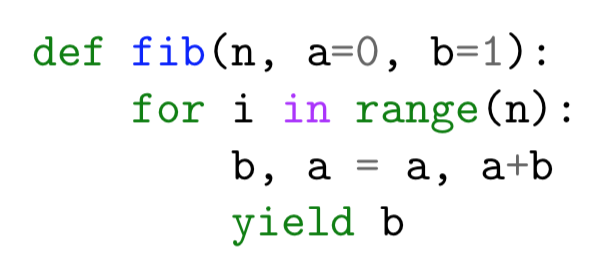
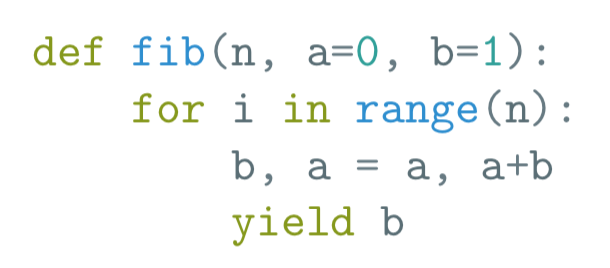

I wrote this because many classmates and friends had little or no
experience with $\rm\LaTeX$ before the MATH-340 class. It can seem tedious, and
sometimes it is, but I hope to provide a few short snippets and tables
for recalling the simple things.

In regards to Jupyter notebooks, perhaps the only non-relevant
information in this document is on environments and packages (anything
$\rm\LaTeX$ specific as opposed to Math specific). All math detail should be
relevant.

(Unfortunately inline code highlighting doesn't seem to work for Github Pages)

---

* toc
{:toc}

---

# $\rm\LaTeX$ Math

## Writing math

Math in $\rm\LaTeX$ is expressed either in an inline block, `$...$`{:.tex} or `\(...\)`
or in a display block, `$$...$$` or `$$...$$` In the former symbols
appear smaller in order for the expression to appear reasonable within
the middle of a line of text. In the latter the expression sits centered
on the page and at full size, as to be displayed. Consider the following
expression as an inline block, $\sum_{j=0}^n a_j$, and as a display block

$$\sum_{j=0}^n a_j$$

We can also force
inline blocks to look like a display block by including `\displaystyle`{:.tex}.
For example, `$\displaystyle\sum_{j=0}^n a_j$`{:.tex} produces
$\displaystyle \sum_{j=0}^n a_j$. And vice versa we can force display
blocks to appear like inline by using the `\textstyle` command.

$$
\textstyle \sum_{j=0}^n a_j
$$

Produced by `$$\textstyle \sum_{j=0}^n a_j$$`

## Subscript and superscript

Subscript and superscript text is set using the underscore and carrot
characters, `_` and `^`, respectively. For example

- `$a_b$` produces $a_b$

- `$a^b$` produces $a^b$

Some symbols have special interactions with these, such as the summation
and limit commands which place the group above/below or to the side when
in either text or display styles

- `$\sum_{j=0}^n$` produces inline $\sum_{j=0}^n$ and display style
  $\displaystyle \sum_{j=0}^n$

- `$\lim{x\to\infty}f(x)=L$` produces inline $\lim_{x\to\infty}f(x)=L$
  and display style $\displaystyle \lim_{x\to\infty}f(x)=L$

## Groupings

Quantities can be grouped with braces { and }. This is needed when we
want multi-digit numbers and such. Groups are often used with subscript
and superscript. For example

- `$2^{32}$` produces $2^{32}$

- `$2_{32}$` produces $2_{32}$

- `$\lim_{x\to 0^+}\ln x=-\infty$` produces
  $\lim_{x\to 0^+}\ln x = -\infty$

Personally, when an argument to a command only ends up being a single
character I omit the brace groups, and often add a space after the
character just to make the code a bit more legible. Can see this above
in `0\^+` a plus character in superscript to the zero.

## Commands

$\rm\LaTeX$ features plenty of commands. Here's an overview of a few.

### Square-root

- `$\sqrt x$` produces $\displaystyle \sqrt x$

- `$\sqrt x+5$` produces $\displaystyle \sqrt x + 1$

- `$\sqrt{x+5}$` produces $\displaystyle \sqrt{x+1}$

### Fractions

The `\frac` command simply places the first argument in the numerator and
second argument in the denominator. (Like `sqrt` this command works without
brace groups too as long as the arguments are single characters, as
`$\frac x y$` produces $\frac x y$, though might be hard to read).

- `$\frac{1+\sqrt 5}{2}$` produces $\displaystyle \frac{1+\sqrt 5}{2}$

- `$\frac{1+p}{2}{\left(\frac{p}{1-p+p^2}\right)}^{21}$` produces
  $\displaystyle \frac{1+p}{2}{\left(\frac{p}{1-p+p^2}\right)}^{21}$

### Parenthesis

Parenthesis, brackets, braces and some other symbols can grow to fit
their contents. The easiest way to do this is with the `\left` and `\right`
commands. For example

- `$(\frac{1+\sqrt 5}\{2\})$` produces
  $\displaystyle (\frac{1+\sqrt 5}{2})$

- `$\left(\frac{1+\sqrt 5}{2}\right)$` produces
  $\displaystyle \left(\frac{1+\sqrt 5}{2}\right)$

These commands also have some other uses

- `$y'(5)=\left.\frac{1}{x^2}\right|_{x=5}=\frac{1}{5^2}$` produces
  $\displaystyle y'(5)=\left.\frac{1}{x^2}\right|_{x=5}=\frac{1}{5^2}$

## Common symbols

If there's a symbol you want to use and know what it should look like
then try the [Detexify](http://detexify.kirelabs.org/classify.html)
website where you can draw the symbol out and it will try to find the
$\rm\LaTeX$ command for it. It's highly likely that if there's a math or
science symbol you desire that it is already defined within one of the
AMS-Math packages

- [`amsmath`](https://www.ctan.org/pkg/amsmath) adds a lot of math
  symbols and improvements to the math system in general.

- [`amsthm`](https://www.ctan.org/pkg/amsthm) implements functionality
  to add and use theorem-like structures in a document as well as some
  additional symbols.

- `amssymb` adds even more symbols, especially relational/logical
  ones.

There's a lot of [lists of the symbols][symbol-list] out there (along with the
[documentation][amsdocs]) but here's a list of my own of a few of the
seemingly most common symbols

[symbol-list]: https://rpi.edu/dept/arc/training/latex/LaTeX_symbols.pdf
[amsdocs]: https://www.ams.org/publications/authors/tex/amslatex

Description | Math command | Output
Circular functions | `\sin` `\cos` | $\sin$, $\cos$
Pi | `\pi` | $\pi$
Infinity | `\infty` | $\infty$
Multiplication dot | `\cdot` | $\cdot$
Multiplication cross | `\times` | $\times$
Arrow (i.e. limits) | `\to` | $\to$
Arrow (i.e. condition) | `\Rightarrow` | $\Rightarrow$
Sum | `\sum` | $\displaystyle \sum$
Product | `\prod` | $\displaystyle \prod$

---

# $\rm\LaTeX$ Stuff

## Macros, `\def` and `\newcommand`

The `\def` command creates a alias to some $\rm\LaTeX$ snippet while the
`\newcommand` command allows you to define a function which can accept
arguments. I wont bother with `\newcommand` though. To define a macro,
`\def` is followed by the new macro name and then by a group containing the
snippet.

```tex
\def\smirk{😏}
\def\fear{😨}

\huge{\sqrt{\smirk^2}=\fear}
```

$$
\def\smirk{😏}
\def\fear{😨}

\huge{\sqrt{\smirk^2}=\fear}
$$

It's common to be entering repetitive and long commands in $\rm\LaTeX$ that
become less of a chore to enter when made into a macro. For instance when typing
up calculus I'd often define a macro to reduce a little bit of tedium. So that


```tex
\frac{d}{dx} y(x)
= \frac{d}{dx}\left(\frac{x^2}{1+x}\right)
= \frac{(1+x)\frac{d}{dx}(x^2)-x^2\frac{d}{dx}(1+x)}{{(1+x)}^2}
```


Becomes


```tex
\def\ddx{\frac{d}{dx}}
\ddx y(x)
= \ddx\left(\frac{x^2}{1+x}\right)
= \frac{(1+x)\ddx(x^2)-x^2\ddx(1+x)}{{(1+x)}^2}
```


But which both still produce the same thing


$$
\def\ddx{\frac{d}{dx}}
\ddx y(x)
= \ddx\left(\frac{x^2}{1+x}\right)
= \frac{(1+x)\ddx(x^2)-x^2\ddx(1+x)}{{(1+x)}^2}
$$


## Environments

In $\rm\LaTeX$ environments provide styles over all the text which they
contain. For example the `center` environment can be used to center text
or a table

```tex
\begin{center}
  This is centered
\end{center}
```

In fact the code snippet there is itself an environment (the `minted`
environment) as well is the entire document. Tables are a common use of
environments; the table of symbols above was produced by the following,
using the `tabu` environment from the package of the same name. The first line
defines a shortcut to the `\mintinline` command called `\mil`, which ends up
being a lot less typing

```tex
\def\mil\mintinline
\begin{tabu}{llc}
  \toprule
  Description & Math command & Output \\
  \midrule
  Circular functions & \mil{tex}{\sin} \mil{tex}{\\cos} & $\sin$, $\cos$ \\
  Pi & \mil{tex}{\pi} & $\pi$ \\
  Infinity & \mil{tex}{\infty} & $\infty$ \\
  Multiplication dot & \mil{tex}{\cdot} & $\cdot$ \\
  Multiplication cross & \mil{tex}{\times} & $\times$ \\
  Arrow (i.e.\ limits) & \mil{tex}{\to} & $\to$ \\
  Arrow (i.e.\ condition) & \mil{tex}{\Rightarrow} & $\Rightarrow$ \\
  Sum & \mil{tex}{\sum} & $\displaystyle \sum$ \\
  Product & \mil{tex}{\prod} & $\displaystyle \prod$ \\
  \bottomrule
\end{tabu}
```

### Math environments

The most common math environments besides `$$...$$` has to be the
`align` and `gather` environments. Both allow math to be broken into
several lines, but align allows you to... align. For example

$$
\begin{aligned}
2 &= 10-4\cdot 2 \\
  &= 10-2(24-10\cdot 2) \\
  &= (34-24)-2(24-2(34-24)) \\
  &= 34-24-2\cdot 24+4(34-24) \\
  &= 34-24-2\cdot 24+4\cdot 34-4\cdot 24 \\
  &= 5\cdot 34-7\cdot 24
\end{aligned}
$$

Is produced by making the equals signs the
alignment character by putting an ampersand `&` in front of them and
breaking lines with a double backslash `\\`

```tex
\begin{align*}
2 &= 10-4\cdot 2 \\
  &= 10-2(24-10\cdot 2) \\
  &= (34-24)-2(24-2(34-24)) \\
  &= 34-24-2\cdot 24+4(34-24) \\
  &= 34-24-2\cdot 24+4\cdot 34-4\cdot 24 \\
  &= 5\cdot 34-7\cdot 24
\end{align*}
```

The star in `align*` just removes equation numbers.

## Packages

### Highlighted code with `minted`

Minted is probably the best package for adding syntax highlighted verbatim
code to $\rm\LaTeX$ documents right now but it depends on the Python
[Pygments][pygments] package, a popular syntax highlighter used all over the
place (especially for static website generators like Jekyll, which made this
very page). So after installing Pygements with

```bash
pip install pygments
```

Which provides the `pygmentize` command (if your `pip` package installation
directory is correctly added to you `PATH` environment variable), we can now
use `minted` (and I'm assuming `minted` is installed already since most big
$\rm\LaTeX$ distributions seem to come with it). In a test tex-file, include in
the preamble the following

```tex
\usepackage{minted}
```

Then in the body include

```tex
\begin{minted}{python}
def fib(n, a=0, b=1):
    for i in range(n):
        b, a = a, a+b
        yield b
\end{minted}
```

But to compile you must include the `-shell-escape` flag, as in

```bash
pdflatex -shell-escape test.tex
```

Then if all goes well the output PDF should have

{:width='300px'}

Delve into the documentation at [minted][minted] to see how to change styles and
what not, but because why not, try installing the
[Solarized][pygments-solarized] style via `pip3 install pygments-solarized-style`,
include in the test file preamble `\usemintedstyle{solarizedlight}` and compile.
The output PDF should have

{:width='300px'}

Then to go even further beyond I wanted to use the [Fira (Fura) Code Font][fira]
with ligatures as my monospaced font. On Mac this font is best installed via
`brew cask install font-firacode-nerd-font` (or `font-fira-code` if you don't want
all of them icons). To then use it in $\rm\LaTeX$ add:

```latex
\usepackage{fontspec}
\setmonofont[Contextuals={Alternate}]{FuraCode Nerd Font}
```
Although the font name is bound to be different depending on which package you
install and/or what OS you're using.

[pygments]: https://pypi.org/project/Pygments/
[minted]: https://ctan.org/pkg/minted
[pygments-solarized]: https://pypi.org/project/pygments-solarized-style/#history
[fira]: https://github.com/tonsky/FiraCode

<!--
   -## Music
   -
   -Outlined in [this article][music-with-latex] it's very possible to
   -
   -[music-with-latex]: https://martin-thoma.com/how-to-write-music-with-latex/
   -->

