---
---

# Surface
- Columns: A–L, Rows: 1–5

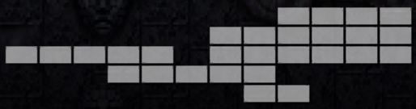

<table>
    <tr>
    <td></td>
    <th>A</th>
    <th>B</th>
    <th>C</th>
    <th>D</th>
    <th>E</th>
    <th>F</th>
    <th>G</th>
    <th>H</th>
    <th>I</th>
    <th>J</th>
    <th>K</th>
    <th>L</th>
    </tr>
    <tr>
    <th>1</th>
    <td></td>
    <td></td>
    <td></td>
    <td></td>
    <td></td>
    <td></td>
    <td></td>
    <td></td>
    <td></td>
    <td></td>
    <td>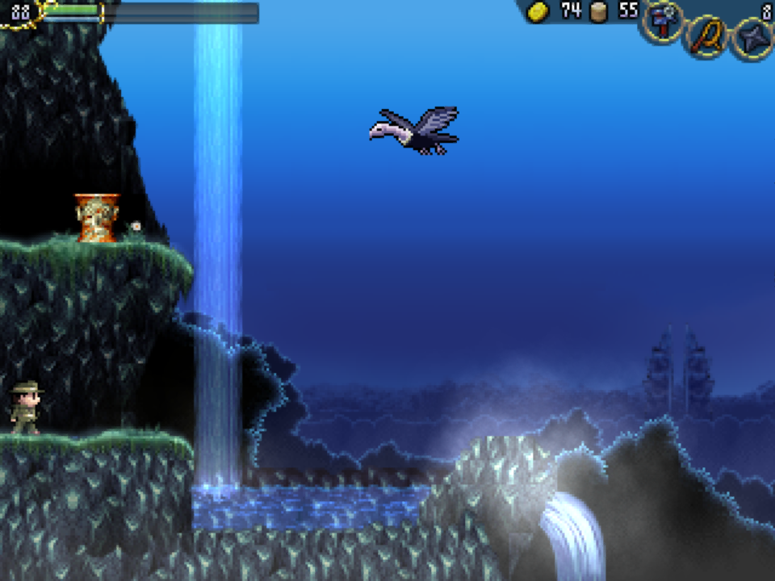</td>
    <td></td>
    </tr>
    <tr>
    <th>2</th>
    <td></td>
    <td></td>
    <td></td>
    <td></td>
    <td></td>
    <td></td>
    <td></td>
    <td></td>
    <td></td>
    <td>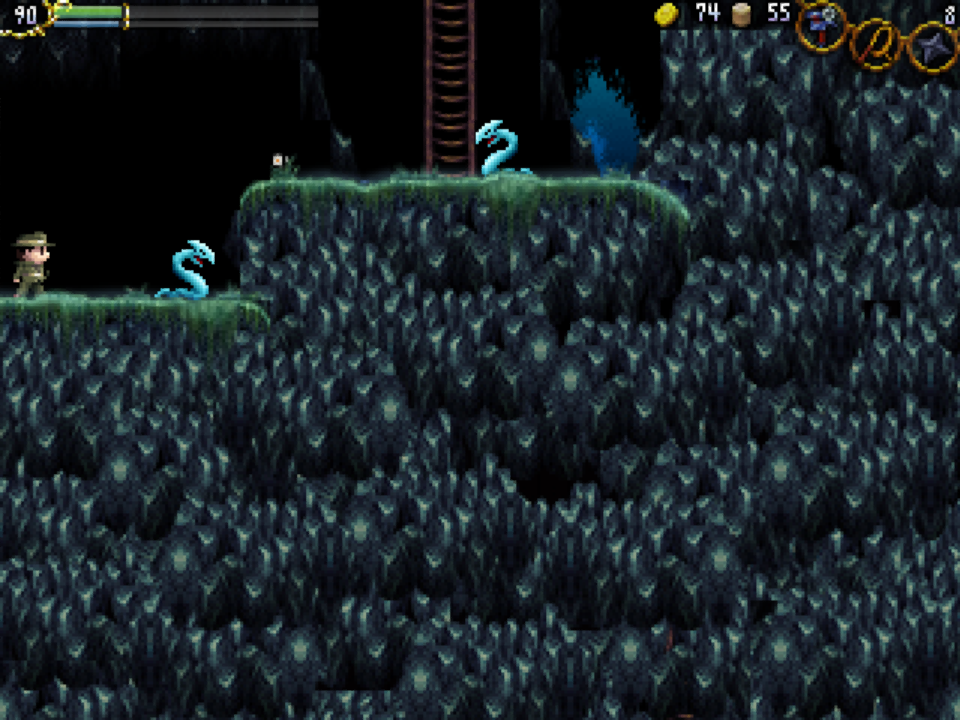</td>
    <td>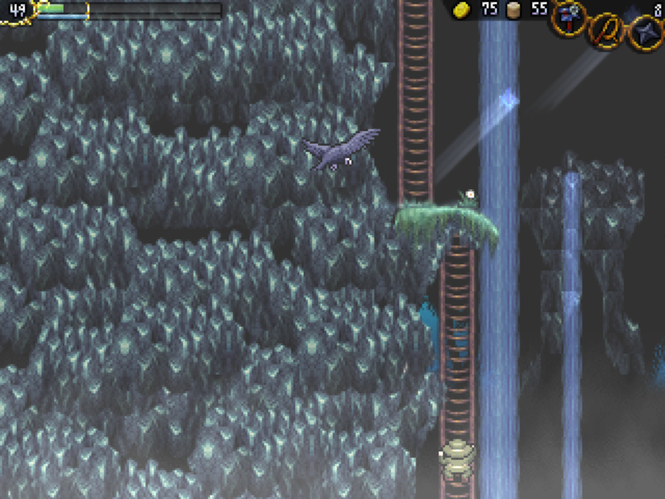</td>
    <td></td>
    </tr>
    <tr>
    <th>3</th>
    <td></td>
    <td></td>
    <td></td>
    <td></td>
    <td>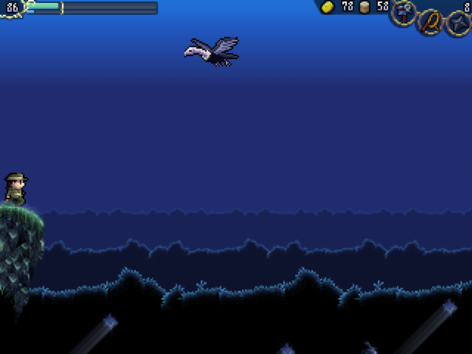</td>
    <td></td>
    <td></td>
    <td>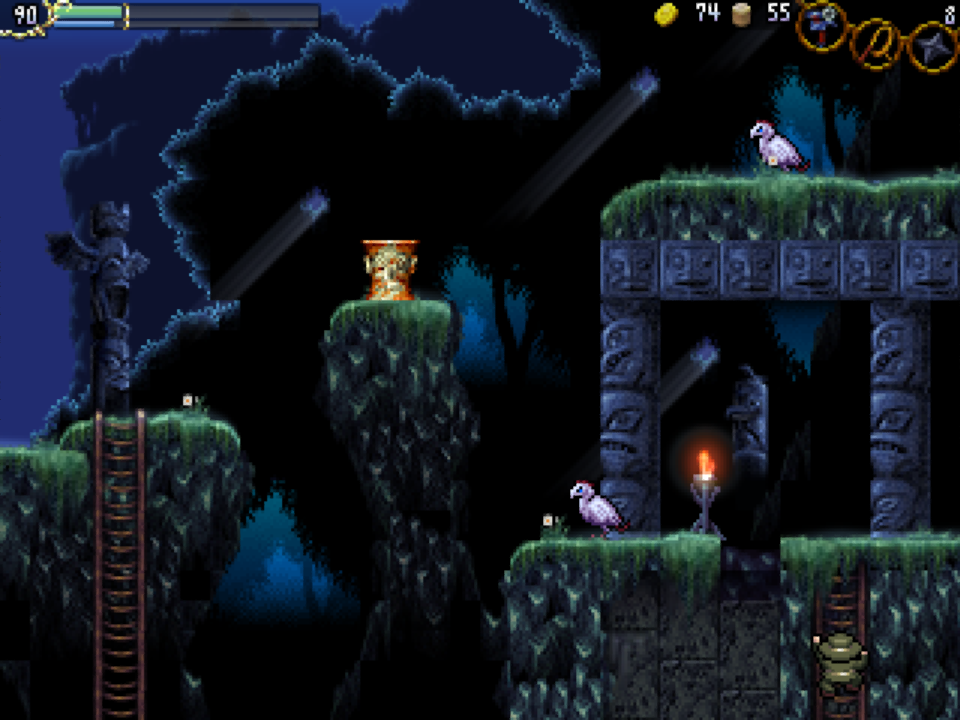</td>
    <td></td>
    <td></td>
    <td></td>
    <td></td>
    </tr>
    <tr>
    <th>4</th>
    <td></td>
    <td></td>
    <td></td>
    <td>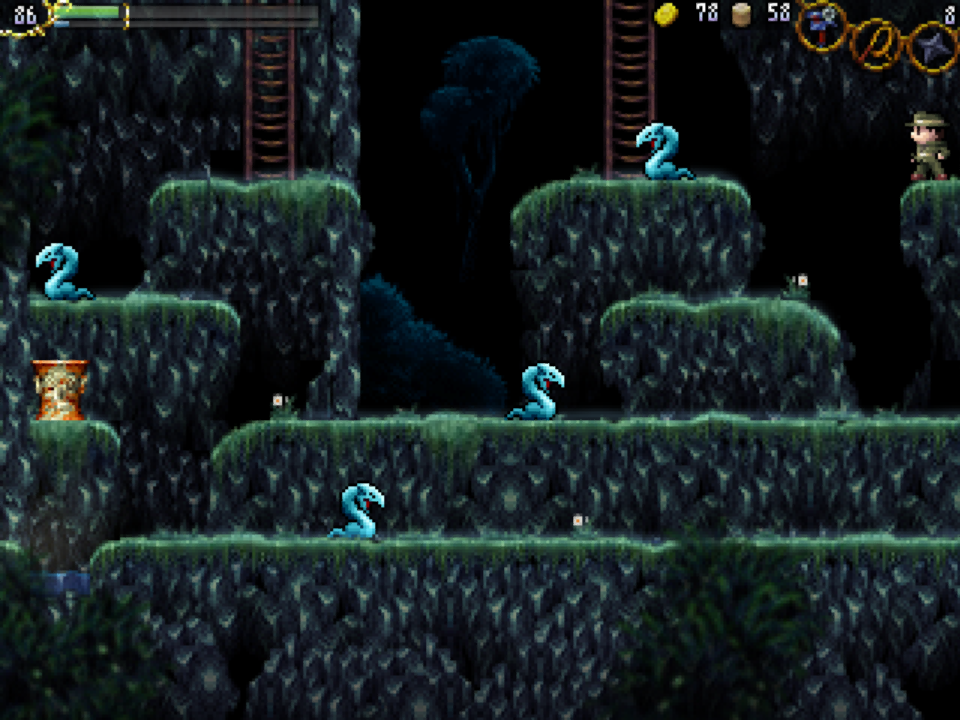</td>
    <td>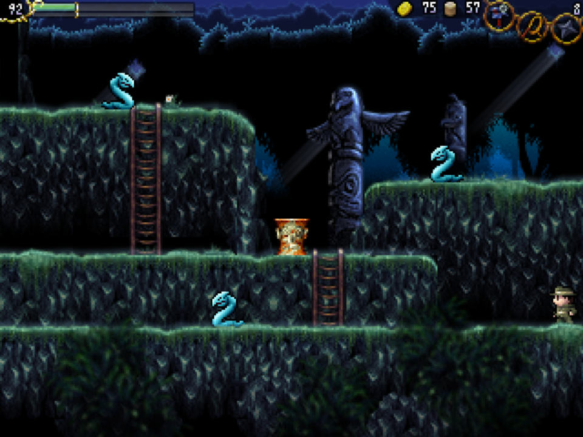</td>
    <td></td>
    <td>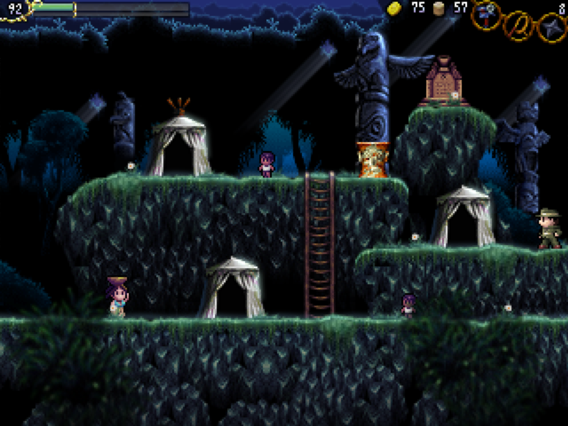</td>
    <td>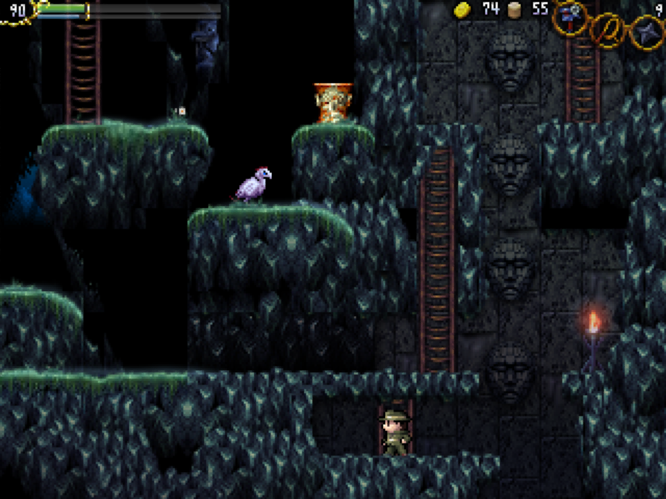</td>
    <td></td>
    <td></td>
    <td></td>
    <td></td>
    </tr>
    <tr>
    <th>5</th>
    <td></td>
    <td></td>
    <td></td>
    <td></td>
    <td></td>
    <td></td>
    <td></td>
    <td></td>
    <td></td>
    <td></td>
    <td></td>
    <td></td>
    </tr>
</table>

# :

# I1: Sound Canyon

# J1: Gazing Hill

-   Sign
>   Rapid water beyond this point.  
>   Weaklings should turn back here.

# K1: Bahrun's Waterfall

# L1: Bahrun's Waterfall

# H2: Foothill

# I2: Sound Canyon

-   Treasure: Shell Horn

# J2: Gazing Hill

# K2: Bahrun's Waterfall

# L2: Bahrun's Waterfall

-   Seal
-   Treasure: ?

# B3: Altar Hill

# C3: Altar Hill

-   NPC: Conversation
>   Legend has it that Argus, a monster with  
>   a blue body that is covered in eyes, is weak  
>   against the Serpent Staff.

-   Sign
>   Danger!!!  
>   No entry beyond this point.

# D3: Cliff in front of the Altar

-   Seal

# E3: Outskirts of the Village

# G3: Foothill

# H3: Gate of Departure

# I3: Sound Canyon

-   Treasure: deathv.exe

# K3: Waterfall of the Goddess

-   Research
>   [Research Mode]  
>   The rocks in this area are a lighter shade.

# L3: Waterfall of the Goddess

# D4: Cliff in front of the Altar

-   Healing spring

# E4: Outskirts of the Village

# F4: Village of Departure

-   NPC: Conversation
>   There's a hot spring on the outskirts of the  
>   village, on the way to the alter.  
>   It's a good way to rest your bones.

-   NPC: Shop
    -   Sells: Weights, yagomap.exe, reader.exe

# G4: Village of Departure

-   NPC: Xelpud
-   NPC: Shop
    -   Sells: Buckler, Waterproof Case, Pistol
-   NPC: Shop
    -   Sells: Scanner, ?, Shuriken Ammo
-   Save
>   This is a Holy Grail Tablet.  
>   You can pick up from the last Holy Grail Tablet you touched, or  
>   save by pressing .  
>   Everyone, make sure to follow the rules when using the Holy  
>   Grail Tablet.
>
>   From Elder Xelpud

# H4: Gate of Departure

# H5: Mother's Split Gate

-   Feature: Split Gate
>   [Archaeology Dictionary: Split Gate]  
>   Similar to the Candi Bentar of Bali Island, but decorated  
>   differently.

# I5: Entrance to La-Mulana Ruins

-   Feature: The Mural of Departure
>   [La-Mulana Ruins Dictionary: The Mural of Departure]  
>   A relatively new mural in the ruins.  
>   It looks like the history of the La-Mulana ruins is detailed here.

-   Tablet
>   Those entering the ruins, beware.  
>   "They" lurk within this land of ordeals.  
>   Death awaits the powerless.  
>   They will speak only to those who have learned.  
>   the seven histories and overcome the challenges herein.

<!-- ---------------------------------------------------------------------------
 ██████   █████  ████████ ███████
██       ██   ██    ██    ██
██   ███ ███████    ██    █████
██    ██ ██   ██    ██    ██
 ██████  ██   ██    ██    ███████

 ██████  ███████      ██████  ██    ██ ██ ██████   █████  ███    ██  ██████ ███████
██    ██ ██          ██       ██    ██ ██ ██   ██ ██   ██ ████   ██ ██      ██
██    ██ █████       ██   ███ ██    ██ ██ ██   ██ ███████ ██ ██  ██ ██      █████
██    ██ ██          ██    ██ ██    ██ ██ ██   ██ ██   ██ ██  ██ ██ ██      ██
 ██████  ██           ██████   ██████  ██ ██████  ██   ██ ██   ████  ██████ ███████
---------------------------------------------------------------------------- -->
---

# Gate of Guidance
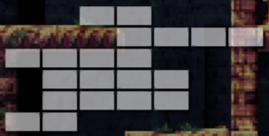
-   Columns: A–G
-   Rows: 1–6
-   Boss: Amphisbaena

<table>
    <tr>
    <td></td>
    <th>A</th>
    <th>B</th>
    <th>C</th>
    <th>D</th>
    <th>E</th>
    <th>F</th>
    <th>G</th>
    </tr>
    <tr>
    <th>1</th>
    <td></td>
    <td></td>
    <td>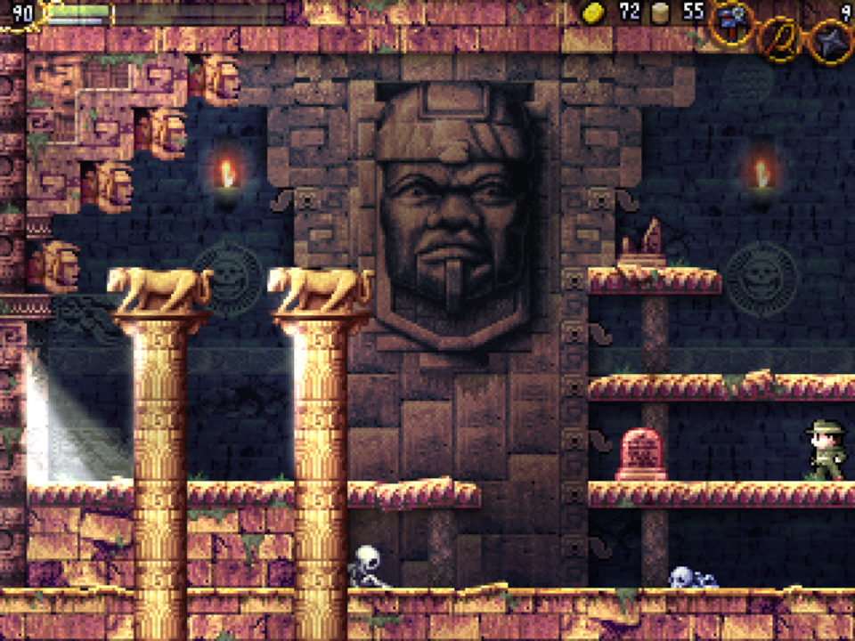</td>
    <td></td>
    <td></td>
    <td></td>
    <td></td>
    </tr>
    <tr>
    <th>2</th>
    <td></td>
    <td></td>
    <td></td>
    <td></td>
    <td></td>
    <td></td>
    <td></td>
    </tr>
    <tr>
    <th>3</th>
    <td></td>
    <td></td>
    <td></td>
    <td></td>
    <td></td>
    <td></td>
    <td></td>
    </tr>
    <tr>
    <th>4</th>
    <td></td>
    <td>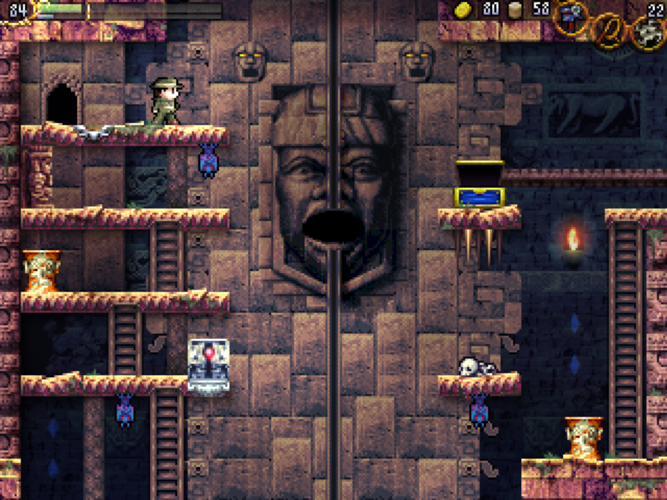</td>
    <td></td>
    <td></td>
    <td>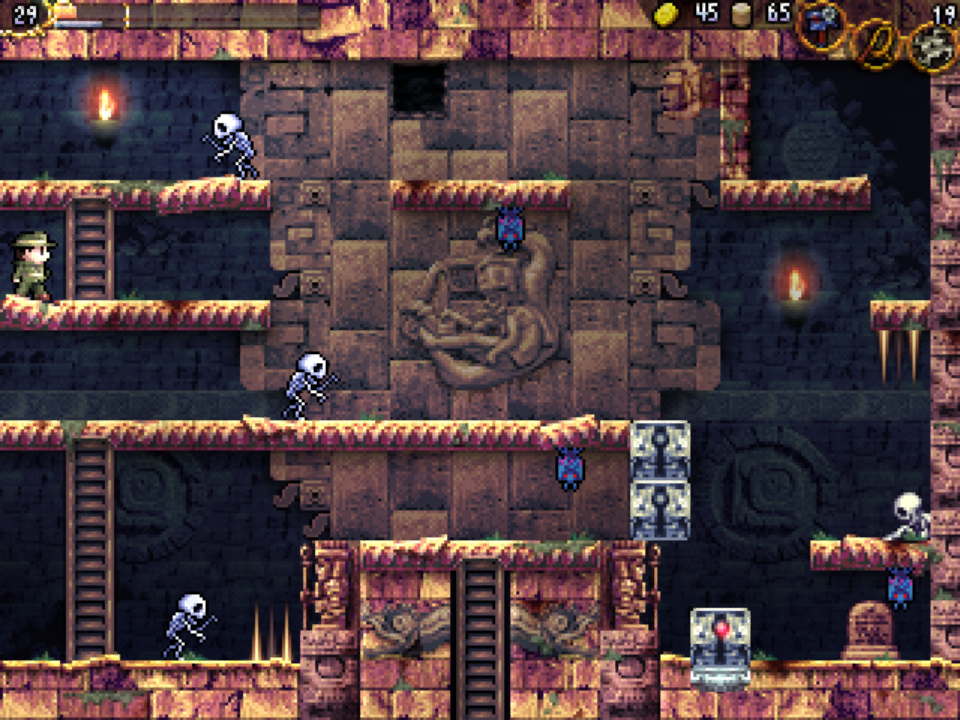</td>
    <td></td>
    <td></td>
    </tr>
    <tr>
    <th>5</th>
    <td></td>
    <td></td>
    <td></td>
    <td></td>
    <td></td>
    <td></td>
    <td></td>
    </tr>
    <tr>
    <th>6</th>
    <td></td>
    <td></td>
    <td></td>
    <td></td>
    <td></td>
    <td></td>
    <td></td>
    </tr>
</table>

## C1: Pillars Gate

-   Skeleton
>   These ruins are littered with traps.  
>   I lack the energy to escape...

-   Tablet
>   This is where the Mother lays to rest.  
>   In this path of trials, only heroes who do not fear death are,  
>   permitted to proceed.

## D1: Pillars Gate

-   Treasure: ?

## D2: Heavenly Temple of the Cross

-   Save
>   Behold the Gate of Guidance.  
>   Death awaits those who would disturb this land.

## E2: Heavenly Temple of the Cross

-   Seal
-   Treasure: ??
-   Tablet
>   Offer 3 lights to the heavens.

## F2: Room of Courage

-   Skeleton
>   Room names are written within the puzzles on the stone tablets.  
>   But how should I know the name of each room in the ruins?  
>   I wish I had a map or something.

-   Skeleton
>   I guess that those who have courage can obtain weapons, but...  
>   If I jump into those spikes I'll die.

-   Tablet
>   Thou traipses on holy ground.  
>   Take care not to cause any needless damage.  
>   Those who do not heed this warning will be dealt punishment  
>   from the Heavens.

-   Tablet
>   Courageous one, embrace the power.  
>   If thou seeketh power, prove thine courage.

## G2: Room of Courage

-   Entrance: Spring in the Sky A6

## A3: Door to Eden

-   Feature: The Sealed Wall
-   Tablet
>   Chi You, the demon who attained the power of eternity by  
>   absorbing the life force of innocent maidens.  
>   Woe unto those that fall into the Sacrificial Abyss.

## B3: Pit of the Holy Grail

-   Tablet
>   There are 8 Ankhs.  
>   8 Anhks that protect the great spirits.  
>   Seek the red light; the Ankh Jewel.  
>   The guardians that slumber within the Ankh will test  
>   thine strength.
>
>   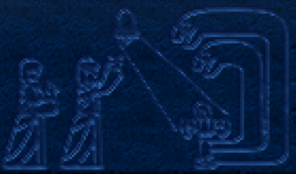

-   Skeleton
>   What is with this...  
>   No matter how many times I try, the treasure box won't open.

## C3: Heavenly Corridor

-   Treasure: ?

## D3: Heavenly Corridor

-   Skeleton
>   ...can't believe I fell for... such an obvious trap...

-   Tablet
>   Those who challenge the Guardian.  
>   Know thy strength.  
>   Death awaits the powerless.  
>   The future awaits those who train themselves and take  
>   on the challenge.

## B4: Pit of the Holy Grail

-   Treasure: Holy Grail
-   NPC: Conversation
>   Eight spirits dwell within this land.  
>   The spirits are the guardians, protectors of these  
>   grounds.  
>   The spirits slumbers within Ankhs that will  
>   shatter under the bright red light.  
>   The spirits will awaken at that time.
>
>   The Ankh of these lands lies far beyond the path  
>   of the gazing faces, and the jewel is at the  
>   foot of the Cliff of Radiance.

-   Skeleton
>   It seems there are shops in these ruins,  
>   Oh well. I'm about to die, so it doesn't matter to me.

## C4: Gate of Giant Faces

-   Tablet
>   It shall connect once held in the mouth.  
>   When on swallows, the other spits out.

## D4: Room of the Strong

-   Feature: An Ancient Mayan Airship?

## E4: Snake's Sanctuary

-   Feature: The Mechanical God
-   Tablet
>   Pour thy memories into the Holy Grail.  
>   Leave thy mark on this land.  
>   Then raise the Holy Grail up and recall lands  
>   once traveled.  
>   In doing so, thou will once again stand upon that land.

-   Skeleton
>   I found an escape route!  
>   These ruins seem to be connected in a very mysterious fashion...

## B5: Pit of the Holy Grail

-   Tablet
>   To those who push the white box:  
>   The white platform and white box are drawn to each other.

## C5: Monument of Oannes

-   Feature: Cross of Light
-   Feature: Oannes
-   Skeleton
>   How many times have I fallen here?  
>   Shoulda figured it's a trap.

-   Skeleton
>   Whoa, that red one is way too strong!  
>   I gotta watch out for that bone attack!  
>   ..Oh ...wait, I'm already all bone. Right.

## D5: Cliff of Radiance

-   Entrance: Temple of the Sun ??
-   Treasure: Jewel
-   Tablet
>   A Watchtower soars above the Temple of the Sun.  
>   Traps to capture theves have been newly set.  
>   In a newly constructed wall, too, the key has been hidden.

## E5: Snake's Sanctuary

-   Ankh: Amphisbaena

## A6: Monument of Time

-   Entrance: Mausoleum of the Giants B1
-   Tablet
>   The Guild runs a hid\_\_n s\_\_\_\_.  
>   Put \_\_\_\_er aside in favor of m\_\_ey and barter.

-   Tablet
>   The sad tale of the Giants.  
>   The tragic history of the Giants is written here.

-   Skeleton
>   I figured out where the Cliff of Radiance is!  
>   But there's some sort of door blocking my way...  
>   Pulling doesn't open it...Actually,  
>   there isn't even a knob to pull.
>
>   I wonder if I was supposed to push...  
>   guess I'll never know.

## B6: Monument of Time

-   NPC: Shop
    -   Sells: Shuriken Ammo, guild.exe, Weights
-   Skeleton
>   "The first age of the sun was destroyed by flood,  
>   The second age of the sun was destroyed by the god of wind,  
>   The third age of the sun was destroyed by the god of fire,  
>   The fourth age of the sun was destroyed by blood and fire  
>   falling from the sky."  
>   The same thing was written in Mayan prophecy.  
>   Could there be a connection?

<!-- ---------------------------------------------------------------------------
███    ███  █████  ██    ██ ███████  ██████  ██      ███████ ██    ██ ███    ███
████  ████ ██   ██ ██    ██ ██      ██    ██ ██      ██      ██    ██ ████  ████
██ ████ ██ ███████ ██    ██ ███████ ██    ██ ██      █████   ██    ██ ██ ████ ██
██  ██  ██ ██   ██ ██    ██      ██ ██    ██ ██      ██      ██    ██ ██  ██  ██
██      ██ ██   ██  ██████  ███████  ██████  ███████ ███████  ██████  ██      ██

 ██████  ███████     ████████ ██   ██ ███████      ██████  ██  █████  ███    ██ ████████ ███████
██    ██ ██             ██    ██   ██ ██          ██       ██ ██   ██ ████   ██    ██    ██
██    ██ █████          ██    ███████ █████       ██   ███ ██ ███████ ██ ██  ██    ██    ███████
██    ██ ██             ██    ██   ██ ██          ██    ██ ██ ██   ██ ██  ██ ██    ██         ██
 ██████  ██             ██    ██   ██ ███████      ██████  ██ ██   ██ ██   ████    ██    ███████
---------------------------------------------------------------------------- -->
---

# Mausoleum of the Giants

-   Columns: A–H
-   Rows: 1–6
-   Boss: Sakit

<table>
    <tr>
    <TD>
    <th>A</th>
    <th>B</th>
    <th>C</th>
    <th>D</th>
    <th>E</th>
    <th>F</th>
    <th>G</th>
    <th>H</th>
    </tr>

    <tr>
    <th>1</th>
    <td></td>
    <td></td>
    <td>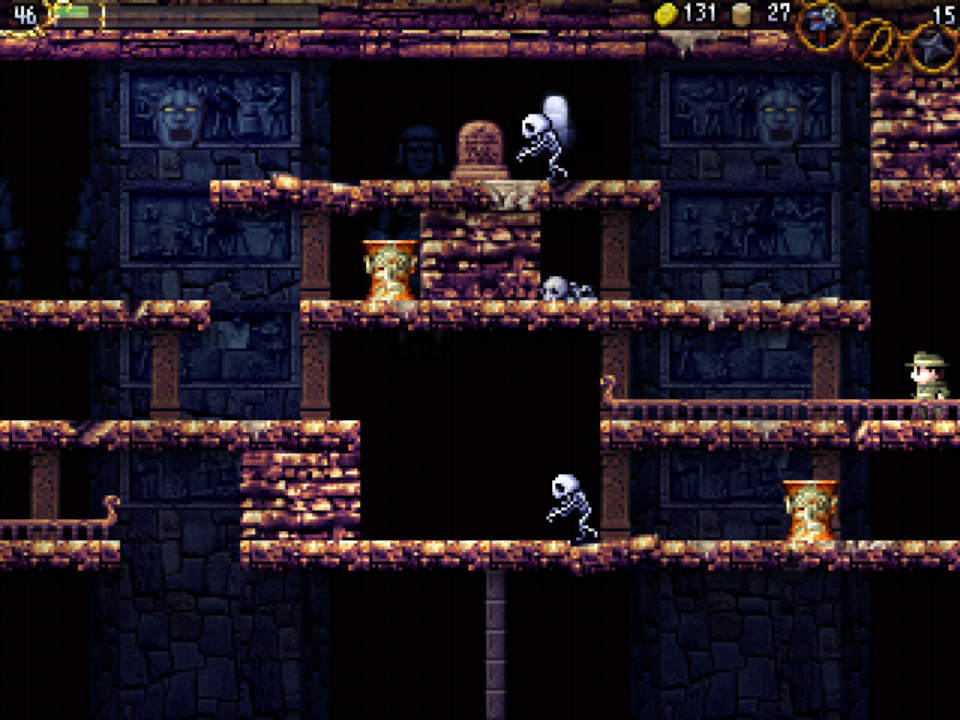</td>
    <td></td>
    </tr>

    <tr>
    <th>2</th>
    <td></td>
    <td></td>
    <td>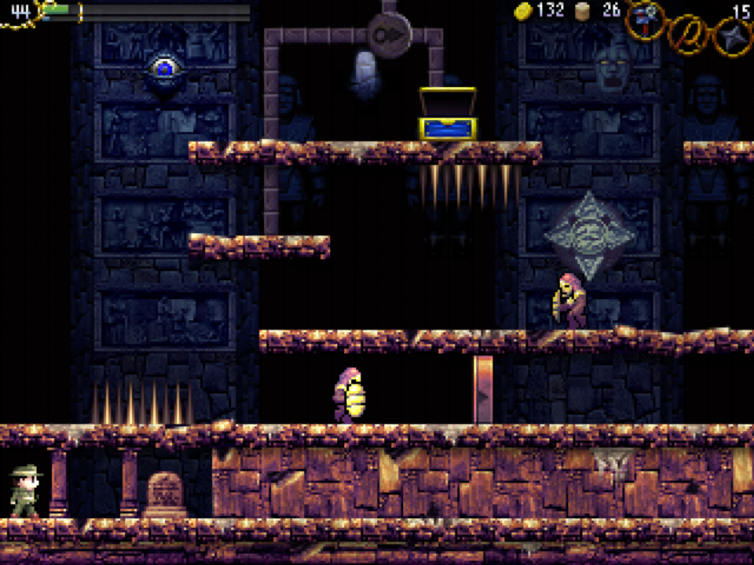</td>
    <td>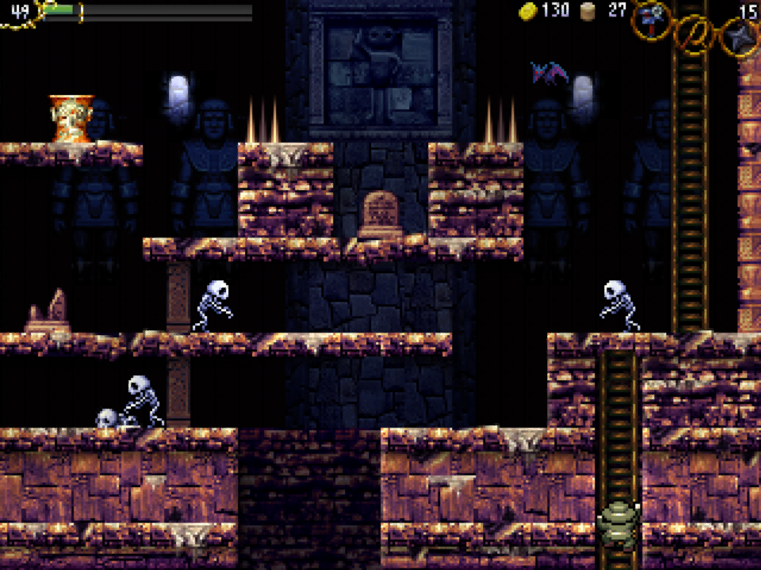</td>
    </tr>

    <tr>
    <th>3</th>
    <td></td>
    <td></td>
    <td></td>
    <td>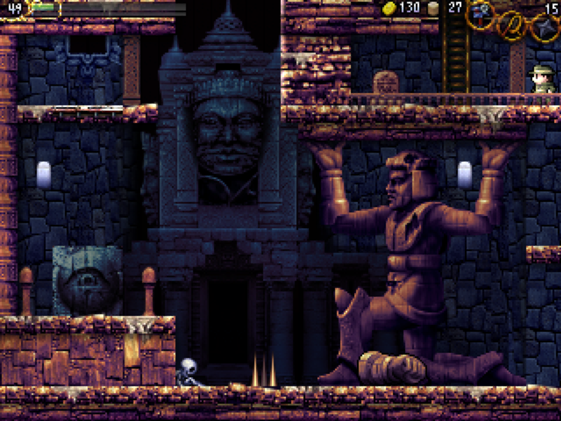</td>
    <td></td>
    <td></td>
    <td></td>
    </tr>

    <tr>
    <th>4</th>
    <td></td>
    <td></td>
    <td></td>
    <td></td>
    <td></td>
    <td>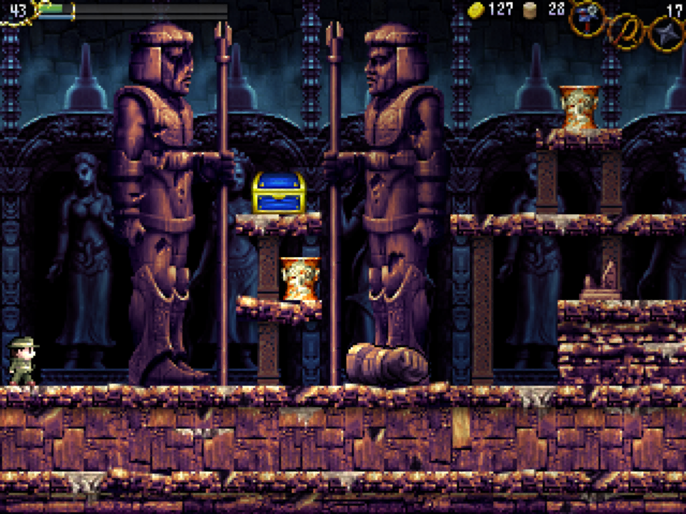</td>
    <td></td>
    <td></td>
    </tr>

    <tr>
    <th>5</th>
    <td></td>
    <td>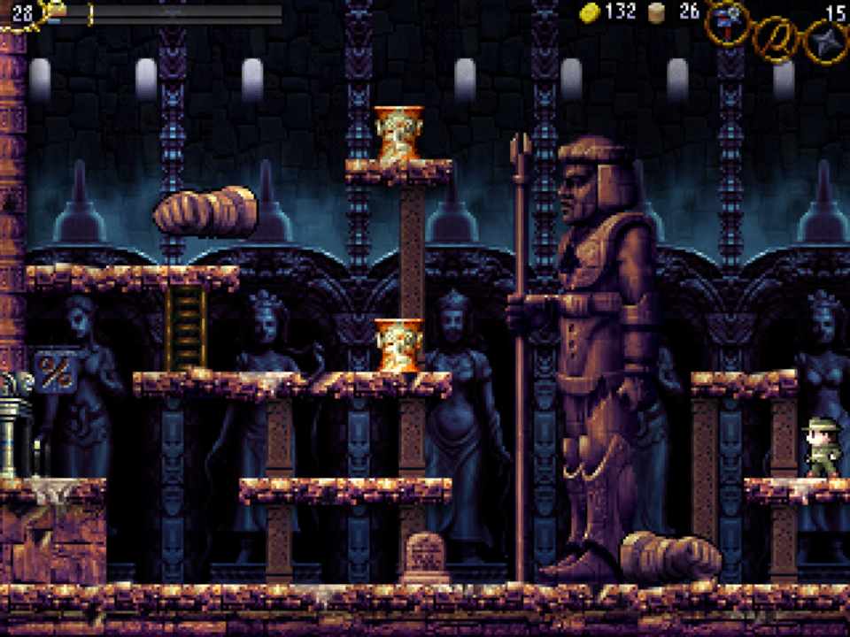</td>
    <td></td>
    <td></td>
    <td></td>
    </tr>

    <tr>
    <th>6</th>
    <td></td>
    <td></td>
    <td></td>
    <td></td>
    <td></td>
    </tr>
</table>

## B1: Last Shrine

-   Skeleton
>   So these are the ruins of those beings known as the Giants  spe
>   I am just THIS close to deciphering the legend of the Giants  
>   but...

## C1: Last Shrine

-   Tablet
>   We were unable to fulfill the Great Mother's wishes.  
>   Now I too, the last remaining of us, am due for a long slumber.
>
>   Abuto

## D1: Room of Redeption

-   NPC: Conversation
>   A Nebra Sky Disk lies beneath this land.  
>   Leap upon what floats there from high above.  
>   The heavens shall then move at your command.

-   Tablet
>   She made even the Giants look tiny.  
>   The Mother was great.  
>   The Giants were great.  
>   Thou art tiny, like a little doll.

-   Tablet
>   Thou are forbidden from again laying eyes on this marker.  
>   Those who heed not this warning will suffer the pain of death.

## A2: Shrine of the Giants

-   Treasure: Rolling Shuriken
-   Tablet
>   Concerned for his brothers, Ribu dug a hole to send the lake's,  
>   water to the tower.  
>   His strength exhausted, he then laid down to rest.

## B2: Approach of the Giants

-   Tablet
>   This is where the Ghost Lord lives.  
>   Come one, come all.  
>   The Ghost Lord will appear before your eyes.  
>   Gather round, gather round.  
>   Sit tight until he is full grown.

## C2: Approach of the Giants

-   Treasure: Map
-   Feature: Cross of Light
-   Tablet
>   For the tower to fly, much water was needed.  
>   Migela carried a lake to this land, then drew his last breath.
>
>   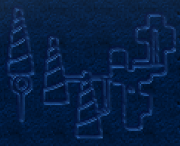

## D2: Room of Redemption

-   Feature: Nazca Lines
-   Tablet
>   The sun shone brightly the day Ledo fell in battle.  
>   A gaping hole in his chest, he entered his final slumber.

## D3: Zebu's Room

-   Feature: The Sealed Wall
-   Tablet
>   Abuto, Ji, Ribu, and Sakit all hoped there  
>   would come day  
>   when the mother would live in this land.

## E3: Shaft to the Heavens

-   Save
>   Behold the Mausoleum of the Giants.  
>   The sad memories of the Giants are contained within.

-   Tablet
>   T'was a moonlit night that Ji started praying to the land.

## F3: Monument to Hermes

-   NPC: Vendor
-   Feature: Wondjina Deity of the Sky
-   Tablet
>   A blanket of countless stars spread over Bado,  
>   falling into a deep slumber.

## G3: Dolphin's Room

-   Tablet
>   Migela is left-handed.

## E4: Shaft to the Heavens

-   Tablet
>   Zebu would no budge,  
>   for he was the one who sustained the land,  
>   but the rest of them split into,  
>   two sides and continued the battle.

## F4: Star Palace of the Giants

-   Tablet
>   Those who plunder the red l\_\_\_\_.  
>   Shall never esc\_\_e.
>
>   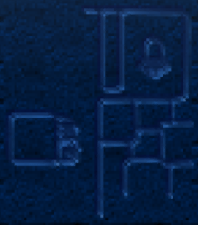

## G4: Star Palace of the Giants

-   Tablet
>   The youngest, Sakit, tread his own path.  
>   He put a key on Ledo's body, falling into slumber with his  
>   powers in hand.

## H4: Star Palace of the Giants

-   Tablet
>   Zebu, the first born, was holding up the land,  
>   and thus unable to move.

-   Skeleton
>   "Strength lies at the foot of Futo".  
>   But which one is Futo...?

## D5: Moon Palace of the Giants

-   Ankh: Sakit

## E5: Shaft to the Heavens

-   Tablet
>   The 1st child had the body of a snake.  
>   The 2nd child, a large body.  
>   The 3rd child soared through the sky.  
>   The 4th child had the body of a fish.  
>   The 5th child had wisdom.  
>   The 6th child was born of the earth.  
>   The 7th child cast the Mother away.  
>   The 8th child did not know the Mother.  
>   Let us place the spirit of the 9th child into  
>   the body of child 0.

-   Tablet
>   In order to return the Mother to the heavens, Bado, Migela  
>   Ledo, and Futo built a flying tower.
>
>   

## E6: Nebra Sky Disk

-   Tablet
>   The celestial bodies lie within.  
>   Control the celestial bodies, and even time may be shifted.

-   Skeleton
>   Seems like for this contraption you need to land on  
>   the floating platform with a lot of power.
>   It won't budge if you don't jump from high enough.
>
>   Proof?  
>   I jump about as good as a stone, so when I hopped onto  
>   the platform I slipped and fell to my death.  
>   How's that for proof?

<!-- ---------------------------------------------------------------------------
███████ ██████  ██████  ██ ███    ██  ██████
██      ██   ██ ██   ██ ██ ████   ██ ██
███████ ██████  ██████  ██ ██ ██  ██ ██   ███
     ██ ██      ██   ██ ██ ██  ██ ██ ██    ██
███████ ██      ██   ██ ██ ██   ████  ██████

██ ███    ██     ████████ ██   ██ ███████     ███████ ██   ██ ██    ██
██ ████   ██        ██    ██   ██ ██          ██      ██  ██   ██  ██
██ ██ ██  ██        ██    ███████ █████       ███████ █████     ████
██ ██  ██ ██        ██    ██   ██ ██               ██ ██  ██     ██
██ ██   ████        ██    ██   ██ ███████     ███████ ██   ██    ██
---------------------------------------------------------------------------- -->
---

# Spring in the Sky
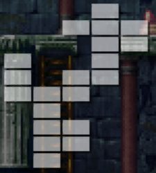
-   Columns: A–E
-   Rows: 1–10
-   Boss: ?

<table>
    <tr>
    <td></td>
    <th>A</th>
    <th>B</th>
    <th>C</th>
    <th>D</th>
    <th>E</th>
    </tr>

    <tr>
    <th>1</th>
    <td></td>
    <td></td>
    <td></td>
    <td></td>
    <td></td>
    </td>

    <tr>
    <th>2</th>
    <td></td>
    <td></td>
    <td></td>
    <td></td>
    <td></td>
    </td>

    <tr>
    <th>3</th>
    <td></td>
    <td></td>
    <td></td>
    <td></td>
    <td></td>
    </td>

    <tr>
    <th>4</th>
    <td>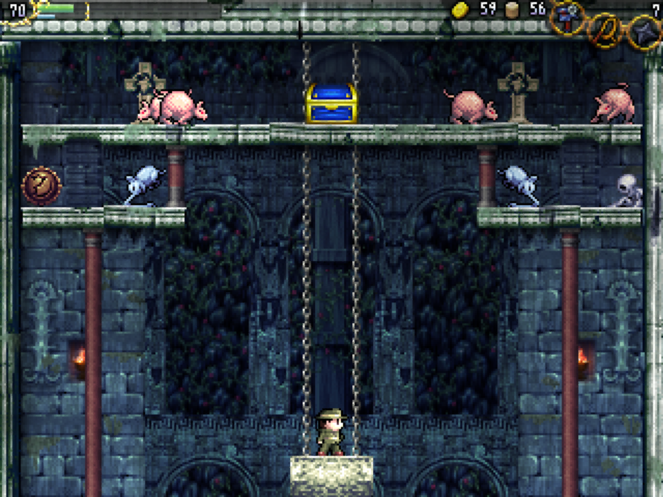</td>
    <td></td>
    <td></td>
    <td></td>
    <td></td>
    </td>

    <tr>
    <th>5</th>
    <td>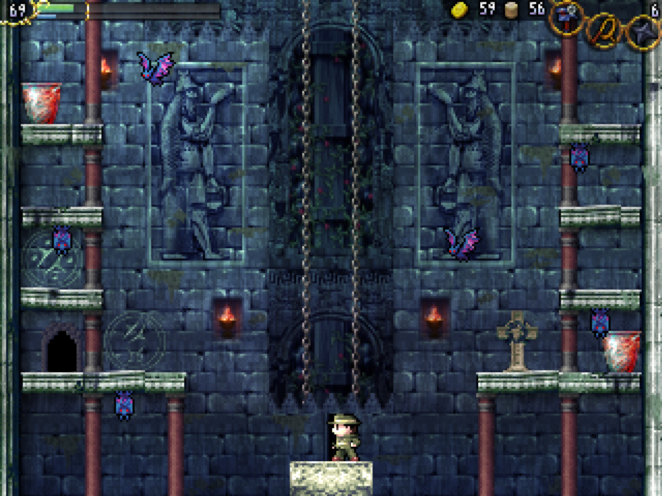</td>
    <td></td>
    <td></td>
    <td></td>
    <td></td>
    </td>

    <tr>
    <th>6</th>
    <td></td>
    <td>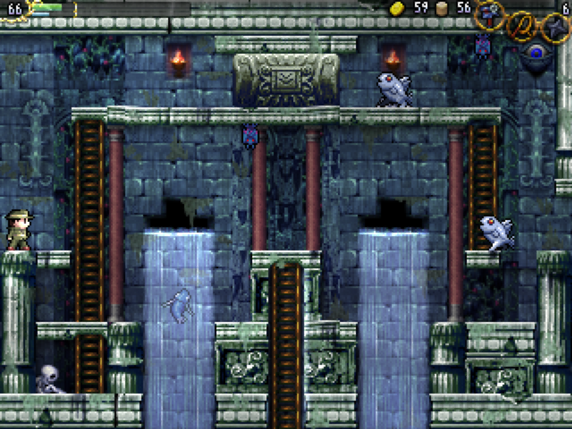</td>
    <td></td>
    <td></td>
    <td></td>
    </td>

    <tr>
    <th>7</th>
    <td></td>
    <td></td>
    <td></td>
    <td></td>
    <td></td>
    </td>

    <tr>
    <th>8</th>
    <td></td>
    <td></td>
    <td></td>
    <td></td>
    <td></td>
    </td>

    <tr>
    <th>9</th>
    <td></td>
    <td></td>
    <td></td>
    <td></td>
    <td></td>
    </td>

    <tr>
    <th>10</th>
    <td></td>
    <td></td>
    <td></td>
    <td></td>
    <td></td>
    </td>
</table>

## A4: ??

-   Skeleton
>   This is the aquaduct that Migela made...  
>   But it looks like it's not working anymore.

## A5: ??

-   Feature: The Philosopher's Sigil
>   [La-Mulana Ruins Dictionary: The Philosopher's Sigil]  
>   A sigil belonging to the legendary Four Philosophers said to be  
>   living in the ruins.  
>   Signifies the Philosopher of Wisdom.

## C5: Sacred Lake

-   Tablet
>   Heal thine tired body.  
>   The fairy will gently heal thou.  
>   The fairy will help thy fight.  
>   The fairy will provide treasure  
>   The fairy will reveal secrets.
>
>   

## D5: Waterfall Approach

## A6: ??

-   Tablet
>   Open the floodgate.  
>   The water will once again flow.  
>   Open the floodgate of Oannes.
>
>   

## B6: ??

-   Skeleton
>   I'll be washed away by that waterfall.  
>   If only I had a Helmet, I could probably get by...

## C6: Goddess' Water Jug

-   Feature: Cross of Light
-   Tablet
>   The priest, Oannes, takes the form of a fish. This land  
>   flourishes under him; as only he may close the floodgate.

## B7: Mirror waterfall

-   Tablet
>   Sail away.  
>   There, thou will find where Bahamut slumbers.  
>   The fish master holds the red light.

<!-- ---------------------------------------------------------------------------
████████ ███████ ███    ███ ██████  ██      ███████
   ██    ██      ████  ████ ██   ██ ██      ██
   ██    █████   ██ ████ ██ ██████  ██      █████
   ██    ██      ██  ██  ██ ██      ██      ██
   ██    ███████ ██      ██ ██      ███████ ███████

 ██████  ███████     ████████ ██   ██ ███████     ███████ ██    ██ ███    ██
██    ██ ██             ██    ██   ██ ██          ██      ██    ██ ████   ██
██    ██ █████          ██    ███████ █████       ███████ ██    ██ ██ ██  ██
██    ██ ██             ██    ██   ██ ██               ██ ██    ██ ██  ██ ██
 ██████  ██             ██    ██   ██ ███████     ███████  ██████  ██   ████
---------------------------------------------------------------------------- -->
---

# Temple of the Sun

-   Columns: A–G
-   Rows: 1–6
-   Boss: ?

<table>
    <tr>
    <td></td>
    <th>A</th>
    <th>B</th>
    <th>C</th>
    <th>D</th>
    <th>E</th>
    <th>F</th>
    <th>G</th>
    </tr>

    <tr>
    <th>1</th>
    <td></td>
    <td>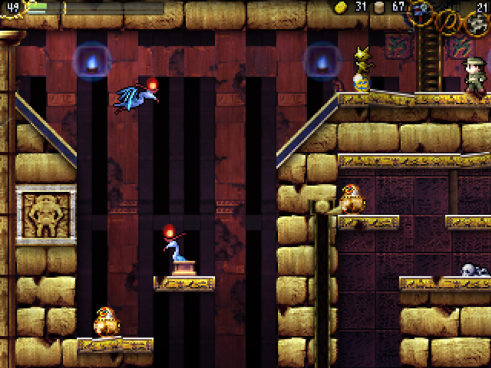</td>
    <td>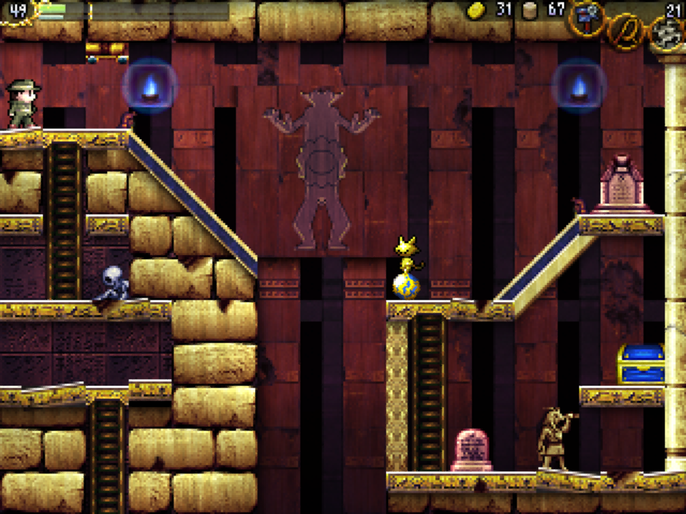</td>
    <td></td>
    <td></td>
    <td></td>
    <td></td>
    </tr>

    <tr>
    <th>2</th>
    <td>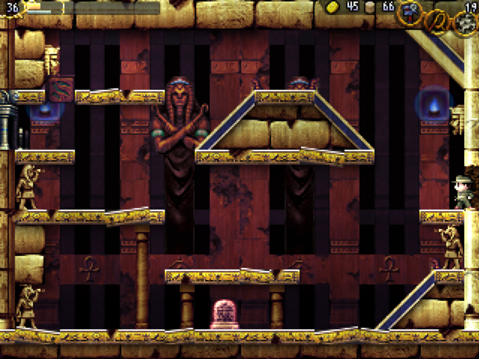</td>
    <td>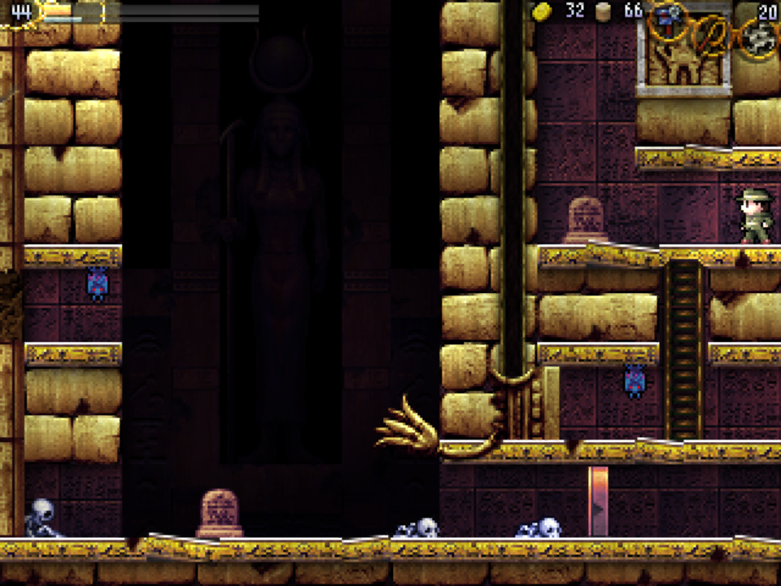</td>
    <td></td>
    <td></td>
    <td></td>
    <td></td>
    <td></td>
    </tr>

    <tr>
    <th>3</th>
    <td></td>
    <td></td>
    <td></td>
    <td></td>
    <td></td>
    <td></td>
    <td></td>
    </tr>

    <tr>
    <th>4</th>
    <td></td>
    <td></td>
    <td></td>
    <td></td>
    <td></td>
    <td></td>
    <td></td>
    </tr>

    <tr>
    <th>5</th>
    <td></td>
    <td></td>
    <td></td>
    <td></td>
    <td></td>
    <td></td>
    <td></td>
    </tr>

    <tr>
    <th>6</th>
    <td></td>
    <td></td>
    <td></td>
    <td></td>
    <td></td>
    <td></td>
    <td></td>
    </tr>
</table>

## B1: Watchtower

-   Skeleton
>   I can't get out...  
>   Where's the catch...?

## C1: Watchtower

-   Feature: The White Giant
-   Treasure: Map
-   Save
>   Behold the Temple of the Sun.  
>   A shrine devoted to courageous men.

-   Tablet
>   Jump into the Sun.

## A2: Isis' Anterior Chamber

-   Tablet
>   Challenge the Inferno Cavern.  
>   The road ahead is long.  
>   Those who proceed, be prepared to face death.

## B2: Hathor's Room

-   Feature: The Statue of Hathor
-   Skeleton
>   Can't... climb.

-   Tablet
>   Cast a light.  
>   The truth shall be revealed.
>
>   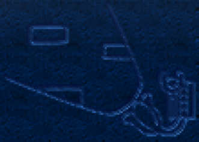

-   Tablet
>   A statue of the Giant waits in the land of inferno.  
>   The words of the spirit are hidden within, but one must wait for  
>   them to present themselves.

## C2: Altar of War

-   Skeleton
>   Can't seem to climb this slope  
>   If only I were just a bit faster.

## D2:

-   NPC: Shop
    -   Sells: Rolling Shuriken Ammo, ?, bunemon.exe

<!-- ---------------------------------------------------------------------------
███████ ███    ██ ██████  ██      ███████ ███████ ███████
██      ████   ██ ██   ██ ██      ██      ██      ██
█████   ██ ██  ██ ██   ██ ██      █████   ███████ ███████
██      ██  ██ ██ ██   ██ ██      ██           ██      ██
███████ ██   ████ ██████  ███████ ███████ ███████ ███████

 ██████  ██████  ██████  ██████  ██ ██████   ██████  ██████
██      ██    ██ ██   ██ ██   ██ ██ ██   ██ ██    ██ ██   ██
██      ██    ██ ██████  ██████  ██ ██   ██ ██    ██ ██████
██      ██    ██ ██   ██ ██   ██ ██ ██   ██ ██    ██ ██   ██
 ██████  ██████  ██   ██ ██   ██ ██ ██████   ██████  ██   ██
---------------------------------------------------------------------------- -->
---

# Endless Corridor

-   Columns: ?
-   Rows: ?
-   Boss: ?

<table>
    <tr>
    <td></td>
    <td></td>
    <td></td>
    <td></td>
    </tr>
</table>

## ??: ??

-   NPC: Fairy Queen
>   Oh my, you're a human.  
>   I am the queen of the fairies that live in  
>   these ruins.  
>   The Four Philosophers instructed us to help the  
>   humans who visit us here, and thus we have  
>   been waiting.
>
>   My fellow faries will help you.  
>   But first you must prove that you're worthy of  
>   our powers.  
>   Find Isis' Pendant, which lies somewhere in  
>   these ruins.
>
>   Bring the pendant to me.  
>   Only then shall we be able to help you.

-   Save stone
>   Behold the Endless Corridor.  
>   A long, endless path.

## ??: ??

-   Infinity key hole

## ??: ??

-   Seal
-   NPC: Hidden store
-   Skeleton
>   The same rooms, no matter how far I go...  
>   So that's what they mean by the corridors being endless.

## ??: ??

-   Tablet
>   Call forth the dragon that sleeps in this land.  
>   Follow the true flow,  
>   and the answer shall be entrusted to the dragon.
>
>   

<!-- ---------------------------------------------------------------------------
███████ ███████  █████  ████████ ██    ██ ██████  ███████ ███████
██      ██      ██   ██    ██    ██    ██ ██   ██ ██      ██
█████   █████   ███████    ██    ██    ██ ██████  █████   ███████
██      ██      ██   ██    ██    ██    ██ ██   ██ ██           ██
██      ███████ ██   ██    ██     ██████  ██   ██ ███████ ███████
---------------------------------------------------------------------------- -->
---

# Features

## Mural depicting a face
-   Found: Gates of Guidance C1, B5, B6
>   [Archaeology Dictionary: Mural depicting a face]  
>   Similar to the colossal Olmec head at the La Venta ruins  
>   in Mexico.

## An Ancient Mayan Airship?
-   Found: Gates of Guidance D4
>   [Archaeology Dictionary: An Ancient Mayan Airship?]  
>   Resembles the ruins of the Olmec civilization in Mexico.  
>   A decorated flute; also looks like a man riding an airship.

## The Mechanical God
-   Found: Gates of Guidance E4
>   [Archaeology Dictionary: The Mechanical God]  
>   Resembles the mural discovered in the La Venta ruins of  
>   the Olmec civilization in Mexico.  
>   Looks like a human riding a dragon-shaped machine.

## Cross of Light
-   Found: Mausoleum of the Giants C2; Spring in the Sky C6
>   [La-Mulana Ruins Dictionary: Cross of Light]  
>   A cross that can be found at various locations.  
>   All were placed at a later time.

## Oannes
-   Found: Gates of Guidance C5
>   [Archaeology Dictionary: Oannes]  
>   A deity in Babylonian mythology, half man, half fish,  
>   who taught the Sumerians wisdom.

## Nazca Lines
-   Found: Mausoleum of the Giants D2
>   [Archaeology Dictionary: Nazca Lines]  
>   A series of ancient geoglyphs located  
>   in the Nazca Desert of Peru.  
>   This mural resembles one of those geoglyphs,  
>   said to be of an alien.

## The Sealed Wall
-   Found: Gate of Guidance A3; Mausoleum of the Giants D3
>   [La-Mulana Ruins Dictionary: The Sealed Wall]  
>   A wall with a relief of a huge eye.  
>   It seems to be hiding something very important.

## Wondjina Deity of the Sky
-   Found: Mausoleum of the Giants B2, F3
>   [Archaeology Dictionary: Wondjina Deity of the Sky]  
>   Resembles the sky deity that appears in Aboriginal mythology.  
>   Resembles an astronaut in full gear.

## The White Giant
-   Found: Temple of the Sun ??
>   [Archaeology Dictionary: The White Giant]  
>   Resembles the mural found in Tassili n'Ajjer in the Sahara Desert  
>   in Algeria.  
>   It is said that the subject is not human, as there are horn-like  
>   objects protruding from the arms and head.

## The Statue of Hathor
-   Found: Temple of the Sun ??
>   [Archaeology Dictionary: The Statue of Hathor]  
>   A statue that resembles the ancient Egyptian deity Hathor.  
>   Goddess of love and joy.
